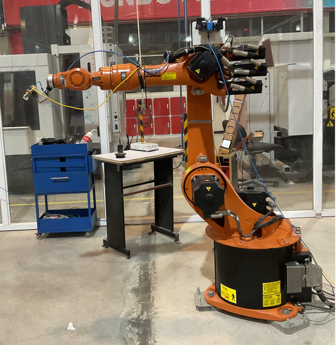
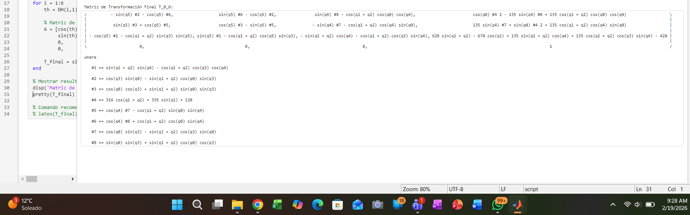
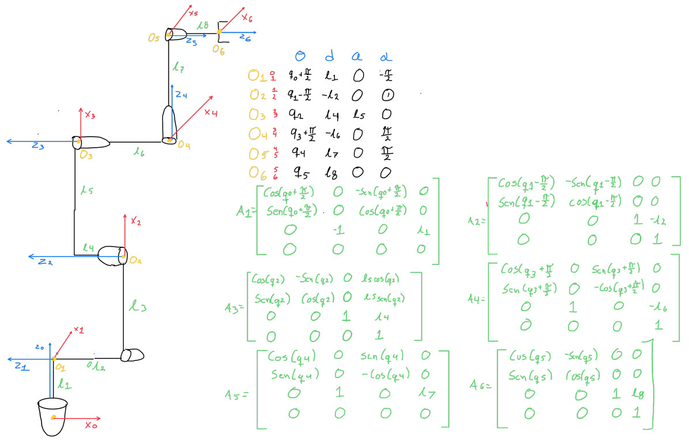

# Work Forward Kinematics for KUKA AN UR ROBOT
## 1) Activity Goals
* Correctly assign coordinate frames to each joint following the DH convention.

* Identify the four specific parameters for each link.

* Organize the extractedvalues into a standard DH parameter table to represent the robot's kinematic structure.

* Get the DH paramaters of each robot.

* know is the kinematics of each robot.

* Know how is the movement in each joint of the kuka and ur robot, looking how is the manufacturer sets it to each positive turn.

## 2) Materials
No materials required 
## Analysis

### Exercise 1 KUKA Robot


* This exercise only has 6 movents: All movements are revolution.



* For to do more easy the analisys of the robot, we can rewrite each joint and link. 


* After to get the DH parametrs table and the matrix of each number, we can do the final matrix, for this step we can use MatLab live script ffor simplify the calculous. 

```
%% CODE MATRIX FINAL
syms q0 q1 q2 q3 q4 q5 real

% I define the table
DH = [
    q0,          -420,  240,  pi/2;
    q1 + pi/2,      0, -670,     0;
    q2,             0,    0, -pi/2;
    q3,          -628,    0,  pi/2;
    q4,             0,    0, -pi/2;
    q5,          -135,    0,     0
];

T_final = eye(4);

for i = 1:6
    th = DH(i,1); d = DH(i,2); a = DH(i,3); al = DH(i,4);
    
    % Matriz de paso i-1 a i
    A = [cos(th), -sin(th)*cos(al),  sin(th)*sin(al), a*cos(th);
         sin(th),  cos(th)*cos(al), -cos(th)*sin(al), a*sin(th);
         0,        sin(al),          cos(al),         d;
         0,        0,                0,               1];
    
    T_final = simplify(T_final * A);
end

disp('Matriz de Transformación Final T_0_6:');
pretty(T_final)

```
## Final matrix

* This the final matrix given by the MatLab code.



### Exercise 2 UR Robot


* This exercise only has 6 movents: All movements are revolution.


* For to do more easy the analisys of the robot, we can rewrite each joint and link. 



* After to get the DH parametrs table and the matrix of each number, we can do the final matrix, for this step we can use MatLab live script ffor simplify the calculous. 

```
clear; clc;


syms q0 q1 q2 q3 q4 q5 real
syms l1 l2 l4 l5 l6 l7 l8 real


DH = [
    q0 + pi/2,   l1,   0,  -pi/2;
    q1 - pi/2,  -l2,   0,      0;
    q2,          l4,  l5,      0;
    q3 + pi/2,  -l6,   0,   pi/2;
    q4,          l7,   0,   pi/2;
    q5,          l8,   0,      0
];


T_final = eye(4);

for i = 1:6
    th = DH(i,1); d = DH(i,2); a = DH(i,3); al = DH(i,4);
    
    A = [cos(th), -sin(th)*cos(al),  sin(th)*sin(al), a*cos(th);
         sin(th),  cos(th)*cos(al), -cos(th)*sin(al), a*sin(th);
         0,        sin(al),          cos(al),         d;
         0,        0,                0,               1];
    
    T_final = simplify(T_final * A);
end
disp('Matriz de Transformación Final T_0_6:');
pretty(T_final) 


```

## Final matrix

* This the final matrix given by the MatLab code.


