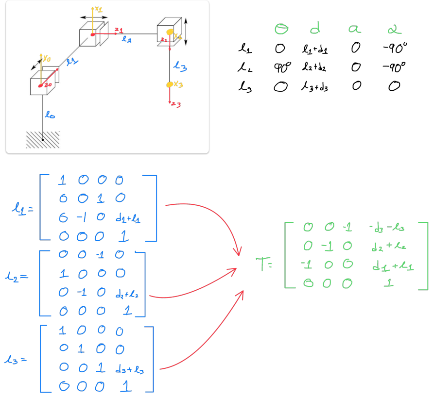

# Work 4: Foward Kinematics
## 1) Activity Goals
Correctly assign coordinate frames to each joint following the DH convention.
Identify the four specific parameters for each link.
Organize the extractedvalues into a standard DH parameter table to represent the robot's kinematic structure.
## 2) Materials
No materials required 
## Analysis

### Exercise 1

* This exercise only has 2 movents: Prismatic and rovolution.

### Exercise 2

* For this exercise we have a robot with 3 prismatic movents and the tool. 

### Exercise 3
* For this exercise the robot has more movements that the las one, for that we have more joints, movents and a tool. 

### Exercise 4

* This exercise is a little confuse because we have movents, joints and tool for that we can to rewrite the robot for do more easy the analisys. 

### Exercise 5

* This exercise is the same to the last one, we have to rewrite the robot for do more easy the analisys. 

