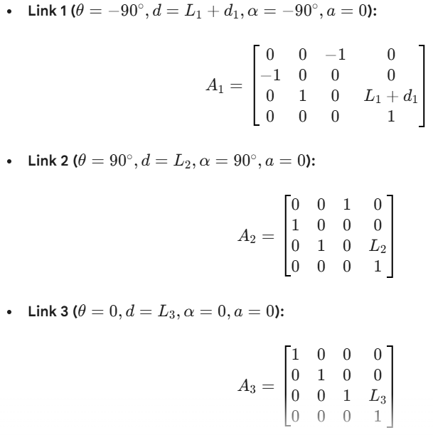
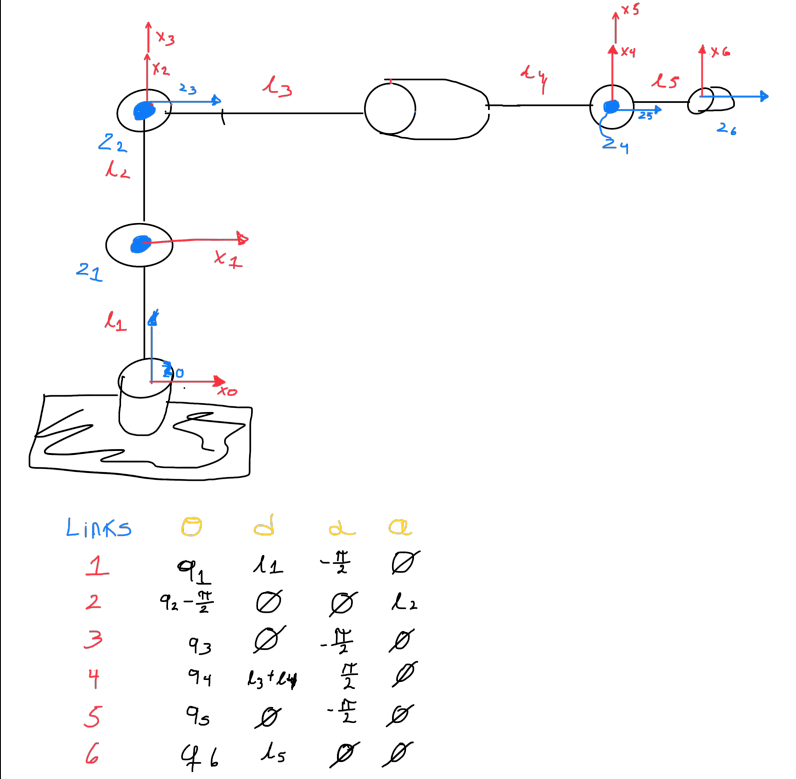

# Work 4: Foward Kinematics
## 1) Activity Goals
Correctly assign coordinate frames to each joint following the DH convention.
Identify the four specific parameters for each link.
Organize the extractedvalues into a standard DH parameter table to represent the robot's kinematic structure.
## 2) Materials
No materials required 
## Analysis

### Exercise 1

In this excersise we have the next draw with simpler view of the robot's movements.

After to get the DH parameters, we have to do each matrix for each link of the robot. 

After in MatLab with the code given, we can get the Transformation Matrix and the positions of X, Y and Z.
This is the link of export in PDF from MatLab live script for look the solution. 

[Enlace directo](https://drive.google.com/file/d/1PJET7tdKitr5-3yt-oC0QMtznAyOjrQ7/view?usp=sharing)

### Exercise 2
In this excersise we have the next draw with simpler view of the robot's movements.

After to get the DH parameters, we have to do each matrix for each link of the robot. 

After in MatLab with the code given, we can get the Transformation Matrix and the positions of X, Y and Z.
This is the link of export in PDF from MatLab live script for look the solution. 

[Enlace directo](https://drive.google.com/file/d/11ayootVqSnsnmFBcGRsNTv3qEc6f4cGM/view?usp=sharing)

### Exercise 3
In this excersise we have the next draw with simpler view of the robot's movements.

After to get the DH parameters, we have to do each matrix for each link of the robot. 

After in MatLab with the code given, we can get the Transformation Matrix and the positions of X, Y and Z.
This is the link of export in PDF from MatLab live script for look the solution. 

[Enlace directo](https://drive.google.com/file/d/1VC_AnTkLNxPH8WjzvM0jmrvzN38OdLJH/view?usp=sharing)

### Exercise 4
In this excersise we have the next draw with simpler view of the robot's movements.

After to get the DH parameters, we have to do each matrix for each link of the robot. 

After in MatLab with the code given, we can get the Transformation Matrix and the positions of X, Y and Z.
This is the link of export in PDF from MatLab live script for look the solution. 

[Enlace directo](https://drive.google.com/file/d/1SZR8y8s029sXMdaxFD37EAbQw3Evddio/view?usp=sharing)

### Exercise 5

In this excersise we have the next draw with simpler view of the robot's movements.

After to get the DH parameters, we have to do each matrix for each link of the robot. 

After in MatLab with the code given, we can get the Transformation Matrix and the positions of X, Y and Z.
This is the link of export in PDF from MatLab live script for look the solution. 

[Enlace directo](https://drive.google.com/file/d/1IPS5uql93wHKRTmIviU0kp033xpUBPwU/view?usp=sharing)

## 4) Code

This code is for each exercise, this code is for live script in MatLab, you should change each parameter with the new value, depending of the degrees of freedom of the robot.

### Code in MatLab (live script)

%% Cálculo de Cinemática Directa (DH)
syms q1 q2 q3 q4 q5 q6 l1 l2 l3 l4 l5 real

% Definición de la función de la matriz DH genérica
% A = dh_matrix(theta, d, alpha, a)
dh = @(th, d, al, a) [cos(th), -sin(th)*cos(al),  sin(th)*sin(al), a*cos(th);
                      sin(th),  cos(th)*cos(al), -cos(th)*sin(al), a*sin(th);
                      0,        sin(al),          cos(al),         d;
                      0,        0,                0,               1];

%% 1. Matrices por Link (Basadas en tu tabla)
% Link:    theta          d         alpha     a
A1 = dh(q1,           l1,       -pi/2,    0);
A2 = dh(q2 - pi/2,    0,        0,        l2);
A3 = dh(q3,           0,        -pi/2,    0);
A4 = dh(q4,           l3 + l4,  pi/2,     0);
A5 = dh(q5,           0,        -pi/2,    0);
A6 = dh(q6,           l5,       0,        0);

%% 2. Matriz de Transformación Final
% Multiplicación de todas las matrices
T06 = A1 * A2 * A3 * A4 * A5 * A6;

% Simplificación algebraica para que sea legible
T06 = simplify(T06);

%% 3. Visualización de resultados
disp('Matriz de Transformación Final T06:')
pretty(T06) % Muestra la matriz en formato matemático legible

% Extraer vector de posición
Px = T06(1,4);
Py = T06(2,4);
Pz = T06(3,4);

fprintf('Posición en X: '); disp(Px)
fprintf('Posición en Y: '); disp(Py)
fprintf('Posición en Z: '); disp(Pz)

