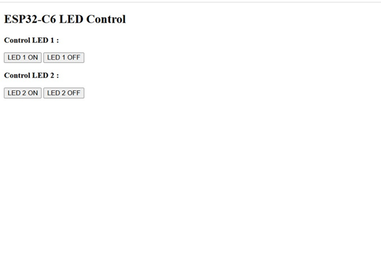
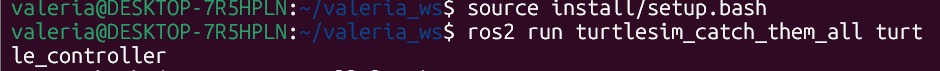

# Work Ros Basics Capstone
## Team 
Yahir Gil Mendoza
Isaac Aleman
Pablo Eduardo López Manzano

## 1) Activity Goals

* Understand the Embedded Server: Set up and manage the lightweight esp_http_server within the ESP-IDF environment.

* Configure URI Handlers: Register and map specific API routes for HTML interfaces and /api/led for JSON endpoints to their corresponding C functions.

* Process HTTP Requests: Successfully read and parse incoming request bodie, particularly extracting JSON data from POST requests to control device hardware in this case a led.

* Manage HTTP Headers: Assign appropriate Content-Type to server responses to ensure browsers correctly interpret them as text/html or application/json.

## 2) Materials
## 3) Procedure
* ESP32‑C6 with USB‑C cable (data-capable)
* LED + 330 Ω resistor + jumper wires
* protoboard
* Motor DC
## 3) Procedure

* First: we use the code given by the teacher, for follow how is the program, html and the IP.

```
/*
 * LAB 3 — ESP32-C6 Wi-Fi + HTTP LED Control 
 *
 * Features:
 *  - Wi-Fi STA connect + reconnect using events
 *  - Wait for IP (WIFI_CONNECTED_BIT)
 *  - Simple GPIO LED control (gpio_reset_pin + gpio_set_direction)
 *  - HTTP server:
 *      GET  /         -> HTML UI
 *      GET  /api/led  -> JSON {"state":0|1}
 *      POST /api/led  -> JSON {"state":0|1} sets LED, returns {"ok":true}
 *
 */
// String handling and standard libraries
#include <string.h>
#include <stdio.h>
#include <stdlib.h>
// FreeRTOS and event groups
#include "freertos/FreeRTOS.h"
#include "freertos/event_groups.h"
// ESP-IDF Logging and error handling
#include "esp_log.h"
#include "esp_err.h"
// Wi-Fi and network
#include "nvs_flash.h"
#include "esp_netif.h"
#include "esp_event.h"
#include "esp_wifi.h"
// GPIO control
#include "driver/gpio.h"
// HTTP server
#include "esp_http_server.h"

/* ===================== User config ===================== */
#define WIFI_SSID "SSID_HERE"
#define WIFI_PASS "PASS_HERE"

/* LED pin */
#define LED_GPIO  8

/* Reconnect policy */
#define MAX_RETRY 10

/* ===================== Globals ===================== */
static const char *TAG = "LAB_3";

// Wi-Fi event group and bit seen in Lab 2
static EventGroupHandle_t s_wifi_event_group;
#define WIFI_CONNECTED_BIT BIT0


static int s_retry = 0;// Retry count for Wi-Fi reconnects

static int s_led_state = 0;               // 0=OFF, 1=ON
static httpd_handle_t s_server = NULL;    // HTTP server handle

/* ===================== LED helpers ===================== */
static void led_init(void)
{
    gpio_reset_pin(LED_GPIO);
    gpio_set_direction(LED_GPIO, GPIO_MODE_OUTPUT);

    s_led_state = 0;
    gpio_set_level(LED_GPIO, s_led_state);

    ESP_LOGI(TAG, "LED initialized on GPIO %d (state=%d)", LED_GPIO, s_led_state);
}

/*Function to set the LED from the state*/
static void led_set(int on)
{
    s_led_state = (on != 0);
    gpio_set_level(LED_GPIO, s_led_state);
    ESP_LOGI(TAG, "LED set to %d", s_led_state);
}

/* ===================== HTTP handlers ===================== */
/*Remember, handlers are special functions that process HTTP requests and generate responses*/


static esp_err_t api_led_get(httpd_req_t *req)
{
    /* resp is a buffer to hold the JSON response  text in this case our jason is
       either {"state":0} or {"state":1} */
    char resp[32];
    /*sprintf is a normal printf for strings, snprintf is safer because it 
    limits the number of characters written to the buffer

    Here we build the JSON string with the current LED state. 
    */
    snprintf(resp, sizeof(resp), "{\"state\":%d}", s_led_state);

    /* Tell the client (browser/Postman/etc.) that the payload is JSON.
       This sets the HTTP header: Content-Type: application/json */
    httpd_resp_set_type(req, "application/json");

    /* Send the response body to the client.
       - 'resp' is the payload
       - HTTPD_RESP_USE_STRLEN tells ESP-IDF to compute the string length automatically
         (it treats resp as a null-terminated C string). */
    httpd_resp_send(req, resp, HTTPD_RESP_USE_STRLEN);

    /* Return ESP_OK so the HTTP server knows the request was handled correctly. */
    return ESP_OK;
}

static esp_err_t api_led_post(httpd_req_t *req)
{
    // Basic safety: reject empty or very large payloads
    if (req->content_len <= 0 || req->content_len > 256) {
        httpd_resp_send_err(req, HTTPD_400_BAD_REQUEST, "Invalid Content-Length");
        return ESP_FAIL;
    }

    char buf[257] = {0}; // +1 for null terminator
    int received = httpd_req_recv(req, buf, req->content_len);
    if (received <= 0) {
        httpd_resp_send_err(req, HTTPD_400_BAD_REQUEST, "Empty body");
        return ESP_FAIL;
    }
    buf[received] = '\0';

    // Minimal parse: find "state":<number>
    int state = -1;
    char *p = strstr(buf, "\"state\"");
    if (p) {
        p = strchr(p, ':');
        if (p) state = atoi(p + 1);
    }

    if (state != 0 && state != 1) {
        httpd_resp_send_err(req, HTTPD_400_BAD_REQUEST, "state must be 0 or 1");
        return ESP_FAIL;
    }

    led_set(state);

    httpd_resp_set_type(req, "application/json");
    httpd_resp_sendstr(req, "{\"ok\":true}");
    return ESP_OK;
}

static esp_err_t root_get_handler(httpd_req_t *req)
{
    // Readable inline HTML
    static const char *INDEX_HTML =
        "<!doctype html>\n"
        "<html>\n"
        "<head>\n"
        "  <meta charset='utf-8'>\n"
        "  <meta name='viewport' content='width=device-width, initial-scale=1'>\n"
        "  <title>ESP32-C6 LED</title>\n"
        "</head>\n"
        "<body>\n"
        "  <h2>ESP32-C6 LED Control</h2>\n"
        "  <button onclick='setLed(1)'>ON</button>\n"
        "  <button onclick='setLed(0)'>OFF</button>\n"
        "  <p id='st'>State: ?</p>\n"
        "\n"
        "  <script>\n"
        "    async function refresh(){\n"
        "      const r = await fetch('/api/led');\n"
        "      const j = await r.json();\n"
        "      document.getElementById('st').innerText = 'State: ' + j.state;\n"
        "    }\n"
        "    async function setLed(v){\n"
        "      await fetch('/api/led', {\n"
        "        method: 'POST',\n"
        "        headers: {'Content-Type':'application/json'},\n"
        "        body: JSON.stringify({state:v})\n"
        "      });\n"
        "      refresh();\n"
        "    }\n"
        "    setInterval(refresh, 1000);\n"
        "    refresh();\n"
        "  </script>\n"
        "</body>\n"
        "</html>\n";

    httpd_resp_set_type(req, "text/html");
    httpd_resp_send(req, INDEX_HTML, HTTPD_RESP_USE_STRLEN);
    return ESP_OK;
}

static void http_server_start(void)
{
    httpd_config_t config = HTTPD_DEFAULT_CONFIG();
    ESP_ERROR_CHECK(httpd_start(&s_server, &config));
    ESP_LOGI(TAG, "HTTP server started");

    httpd_uri_t root = {
        .uri      = "/",
        .method   = HTTP_GET,
        .handler  = root_get_handler,
        .user_ctx = NULL
    };

    httpd_uri_t led_get = {
        .uri      = "/api/led",
        .method   = HTTP_GET,
        .handler  = api_led_get,
        .user_ctx = NULL
    };

    httpd_uri_t led_post = {
        .uri      = "/api/led",
        .method   = HTTP_POST,
        .handler  = api_led_post,
        .user_ctx = NULL
    };

    ESP_ERROR_CHECK(httpd_register_uri_handler(s_server, &root));
    ESP_ERROR_CHECK(httpd_register_uri_handler(s_server, &led_get));
    ESP_ERROR_CHECK(httpd_register_uri_handler(s_server, &led_post));

    ESP_LOGI(TAG, "Routes registered: /  ,  GET/POST /api/led");
}

/* ===================== Wi-Fi STA connect + events ===================== */

static void wifi_event_handler(void *arg,
                               esp_event_base_t event_base,
                               int32_t event_id,
                               void *event_data)
{
    if (event_base == WIFI_EVENT && event_id == WIFI_EVENT_STA_START) {
        ESP_LOGI(TAG, "WIFI_EVENT_STA_START -> esp_wifi_connect()");
        ESP_ERROR_CHECK(esp_wifi_connect());
        return;
    }

    if (event_base == WIFI_EVENT && event_id == WIFI_EVENT_STA_DISCONNECTED) {
        if (s_retry < MAX_RETRY) {
            s_retry++;
            ESP_LOGW(TAG, "Disconnected. Retrying (%d/%d)...", s_retry, MAX_RETRY);
            ESP_ERROR_CHECK(esp_wifi_connect());
        } else {
            ESP_LOGE(TAG, "Failed to connect after %d retries.", MAX_RETRY);
        }
        return;
    }

    if (event_base == IP_EVENT && event_id == IP_EVENT_STA_GOT_IP) {
        ip_event_got_ip_t *event = (ip_event_got_ip_t *)event_data;
        ESP_LOGI(TAG, "Got IP: " IPSTR, IP2STR(&event->ip_info.ip));

        s_retry = 0;
        xEventGroupSetBits(s_wifi_event_group, WIFI_CONNECTED_BIT);
        return;
    }
}

static void wifi_init_sta(void)
{
    s_wifi_event_group = xEventGroupCreate();

    ESP_ERROR_CHECK(esp_netif_init());
    ESP_ERROR_CHECK(esp_event_loop_create_default());
    esp_netif_create_default_wifi_sta();

    wifi_init_config_t cfg = WIFI_INIT_CONFIG_DEFAULT();
    ESP_ERROR_CHECK(esp_wifi_init(&cfg));

    ESP_ERROR_CHECK(esp_event_handler_register(WIFI_EVENT, ESP_EVENT_ANY_ID, &wifi_event_handler, NULL));
    ESP_ERROR_CHECK(esp_event_handler_register(IP_EVENT, IP_EVENT_STA_GOT_IP, &wifi_event_handler, NULL));

    wifi_config_t wifi_config = {0};
    strncpy((char *)wifi_config.sta.ssid, WIFI_SSID, sizeof(wifi_config.sta.ssid));
    strncpy((char *)wifi_config.sta.password, WIFI_PASS, sizeof(wifi_config.sta.password));

    ESP_LOGI(TAG, "Configuring Wi-Fi STA: SSID='%s'", WIFI_SSID);

    ESP_ERROR_CHECK(esp_wifi_set_mode(WIFI_MODE_STA));
    ESP_ERROR_CHECK(esp_wifi_set_config(WIFI_IF_STA, &wifi_config));
    ESP_ERROR_CHECK(esp_wifi_start());
}

/* ===================== app_main ===================== */

void app_main(void)
{
    ESP_LOGI(TAG, "Lab D start: Wi-Fi + HTTP + LED control.");

    // NVS init (required by Wi-Fi)
    esp_err_t ret = nvs_flash_init();
    if (ret == ESP_ERR_NVS_NO_FREE_PAGES || ret == ESP_ERR_NVS_NEW_VERSION_FOUND) {
        ESP_ERROR_CHECK(nvs_flash_erase());
        ESP_ERROR_CHECK(nvs_flash_init());
    } else {
        ESP_ERROR_CHECK(ret);
    }

    // Connect to Wi-Fi (STA)
    wifi_init_sta();

    // Wait for "got IP" (connected)
    EventBits_t bits = xEventGroupWaitBits(
        s_wifi_event_group,
        WIFI_CONNECTED_BIT,
        pdFALSE,
        pdTRUE,
        pdMS_TO_TICKS(30000)
    );

    if (!(bits & WIFI_CONNECTED_BIT)) {
        ESP_LOGE(TAG, "Timeout waiting for Wi-Fi connection. Check SSID/PASS and 2.4 GHz.");
        return;
    }

    // Start peripherals + HTTP
    led_init();
    http_server_start();

    ESP_LOGI(TAG, "Open: http://<ESP_IP>/ from a device on the same network.");
}

```
* Second: We have to add in the code the second led and change the .html for add another button.

### Code with 2 buttons and 2 leds

```
/*
 * LAB 3 — ESP32-C6 Wi-Fi + HTTP LED Control 
 */

#include <string.h>
#include <stdio.h>

#include "freertos/FreeRTOS.h"
#include "freertos/event_groups.h"

#include "esp_log.h"
#include "esp_err.h"

#include "nvs_flash.h"
#include "esp_netif.h"
#include "esp_event.h"
#include "esp_wifi.h"

#include "driver/gpio.h"
#include "esp_http_server.h"

/* ===================== User config ===================== */
#define WIFI_SSID "iPhone"
#define WIFI_PASS "12345678"

#define LED_GPIO   8
#define LED2_GPIO  1  // Segundo LED agregado en GPIO 01
#define MAX_RETRY 10

/* ===================== Globals ===================== */
static const char *TAG = "LAB_3";

static EventGroupHandle_t s_wifi_event_group;
#define WIFI_CONNECTED_BIT BIT0

static int s_retry = 0;
static int s_led_state = 0;            // 0=OFF, 1=ON
static int s_led2_state = 0;           // Estado para el segundo LED
static httpd_handle_t s_server = NULL;

/* ===================== LED helpers ===================== */
static void led_init(void)
{
    // Inicializar LED 1
    gpio_reset_pin(LED_GPIO);
    gpio_set_direction(LED_GPIO, GPIO_MODE_OUTPUT);
    s_led_state = 0;
    gpio_set_level(LED_GPIO, s_led_state);

    // Inicializar LED 2 (GPIO 01)
    gpio_reset_pin(LED2_GPIO);
    gpio_set_direction(LED2_GPIO, GPIO_MODE_OUTPUT);
    s_led2_state = 0;
    gpio_set_level(LED2_GPIO, s_led2_state);

    ESP_LOGI(TAG, "LEDs initialized: GPIO %d and GPIO %d", LED_GPIO, LED2_GPIO);
}

static void led_set(int on)
{
    s_led_state = (on != 0);
    gpio_set_level(LED_GPIO, s_led_state);
}

static void led2_set(int on)
{
    s_led2_state = (on != 0);
    gpio_set_level(LED2_GPIO, s_led2_state);
}

/* ===================== HTTP Handlers ===================== */

static esp_err_t root_get_handler(httpd_req_t *req)
{
    static const char *INDEX_HTML =
        "<!doctype html>\n"
        "<html><head>\n"
        "  <meta charset='utf-8'>\n"
        "  <meta name='viewport' content='width=device-width, initial-scale=1'>\n"
        "  <title>ESP32-C6 LED Control</title>\n"
        "</head><body>\n"
        "  <h2>ESP32-C6 LED Control</h2>\n"
        "  <p><strong>Control LED 1 :</strong></p>\n"
        "  <p>\n"
        "    <a href='/ledon'><button>LED 1 ON</button></a>\n"
        "    <a href='/ledoff'><button>LED 1 OFF</button></a>\n"
        "  </p>\n"
        "  <p><strong>Control LED 2 :</strong></p>\n"
        "  <p>\n"
        "    <a href='/led2on'><button>LED 2 ON</button></a>\n"
        "    <a href='/led2off'><button>LED 2 OFF</button></a>\n"
        "  </p>\n"
        "</body></html>\n";

    httpd_resp_set_type(req, "text/html");
    httpd_resp_send(req, INDEX_HTML, HTTPD_RESP_USE_STRLEN);
    return ESP_OK;
}

static esp_err_t ledon_get_handler(httpd_req_t *req)
{
    led_set(1);
    static const char *RESP = "<!doctype html><html><body><h3>LED 1 is now: ON</h3><p><a href='/'><button>Back</button></a></p></body></html>";
    httpd_resp_set_type(req, "text/html");
    httpd_resp_send(req, RESP, HTTPD_RESP_USE_STRLEN);
    return ESP_OK;
}

static esp_err_t ledoff_get_handler(httpd_req_t *req)
{
    led_set(0);
    static const char *RESP = "<!doctype html><html><body><h3>LED 1 is now: OFF</h3><p><a href='/'><button>Back</button></a></p></body></html>";
    httpd_resp_set_type(req, "text/html");
    httpd_resp_send(req, RESP, HTTPD_RESP_USE_STRLEN);
    return ESP_OK;
}

static esp_err_t led2on_get_handler(httpd_req_t *req)
{
    led2_set(1);
    static const char *RESP = "<!doctype html><html><body><h3>LED 2 is now: ON</h3><p><a href='/'><button>Back</button></a></p></body></html>";
    httpd_resp_set_type(req, "text/html");
    httpd_resp_send(req, RESP, HTTPD_RESP_USE_STRLEN);
    return ESP_OK;
}

static esp_err_t led2off_get_handler(httpd_req_t *req)
{
    led2_set(0);
    static const char *RESP = "<!doctype html><html><body><h3>LED 2 is now: OFF</h3><p><a href='/'><button>Back</button></a></p></body></html>";
    httpd_resp_set_type(req, "text/html");
    httpd_resp_send(req, RESP, HTTPD_RESP_USE_STRLEN);
    return ESP_OK;
}

/* ===================== HTTP Server Start + Route Registration ===================== */

static void http_server_start(void)
{
    httpd_config_t config = HTTPD_DEFAULT_CONFIG();
    ESP_ERROR_CHECK(httpd_start(&s_server, &config));

    httpd_uri_t root = { .uri = "/", .method = HTTP_GET, .handler = root_get_handler };
    httpd_uri_t ledon = { .uri = "/ledon", .method = HTTP_GET, .handler = ledon_get_handler };
    httpd_uri_t ledoff = { .uri = "/ledoff", .method = HTTP_GET, .handler = ledoff_get_handler };
    httpd_uri_t led2on = { .uri = "/led2on", .method = HTTP_GET, .handler = led2on_get_handler };
    httpd_uri_t led2off = { .uri = "/led2off", .method = HTTP_GET, .handler = led2off_get_handler };

    ESP_ERROR_CHECK(httpd_register_uri_handler(s_server, &root));
    ESP_ERROR_CHECK(httpd_register_uri_handler(s_server, &ledon));
    ESP_ERROR_CHECK(httpd_register_uri_handler(s_server, &ledoff));
    ESP_ERROR_CHECK(httpd_register_uri_handler(s_server, &led2on));
    ESP_ERROR_CHECK(httpd_register_uri_handler(s_server, &led2off));

    ESP_LOGI(TAG, "Routes registered: LED 1 and LED 2 controls available.");
}

/* ===================== Wi-Fi STA connect + events (Sin cambios) ===================== */

static void wifi_event_handler(void *arg, esp_event_base_t event_base, int32_t event_id, void *event_data)
{
    if (event_base == WIFI_EVENT && event_id == WIFI_EVENT_STA_START) {
        esp_wifi_connect();
    } else if (event_base == WIFI_EVENT && event_id == WIFI_EVENT_STA_DISCONNECTED) {
        if (s_retry < MAX_RETRY) {
            s_retry++;
            esp_wifi_connect();
        }
    } else if (event_base == IP_EVENT && event_id == IP_EVENT_STA_GOT_IP) {
        s_retry = 0;
        xEventGroupSetBits(s_wifi_event_group, WIFI_CONNECTED_BIT);
    }
}

static void wifi_init_sta(void)
{
    s_wifi_event_group = xEventGroupCreate();
    esp_netif_init();
    esp_event_loop_create_default();
    esp_netif_create_default_wifi_sta();
    wifi_init_config_t cfg = WIFI_INIT_CONFIG_DEFAULT();
    esp_wifi_init(&cfg);
    esp_event_handler_register(WIFI_EVENT, ESP_EVENT_ANY_ID, &wifi_event_handler, NULL);
    esp_event_handler_register(IP_EVENT, IP_EVENT_STA_GOT_IP, &wifi_event_handler, NULL);
    wifi_config_t wifi_config = {0};
    strncpy((char *)wifi_config.sta.ssid, WIFI_SSID, sizeof(wifi_config.sta.ssid));
    strncpy((char *)wifi_config.sta.password, WIFI_PASS, sizeof(wifi_config.sta.password));
    esp_wifi_set_mode(WIFI_MODE_STA);
    esp_wifi_set_config(WIFI_IF_STA, &wifi_config);
    esp_wifi_start();
}

/* ===================== app_main ===================== */

void app_main(void)
{
    esp_err_t ret = nvs_flash_init();
    if (ret == ESP_ERR_NVS_NO_FREE_PAGES || ret == ESP_ERR_NVS_NEW_VERSION_FOUND) {
        ESP_ERROR_CHECK(nvs_flash_erase());
        ESP_ERROR_CHECK(nvs_flash_init());
    }
    wifi_init_sta();
    xEventGroupWaitBits(s_wifi_event_group, WIFI_CONNECTED_BIT, pdFALSE, pdTRUE, pdMS_TO_TICKS(30000));
    
    led_init();
    http_server_start();
}
```
* Third: For this step, we hace to add a counter, this counter is for when we push on or off, the counter will go count each push. 

### Code 2 add the counter.


```
/*
 * LAB 3 — ESP32-C6 Wi-Fi + HTTP LED Control + Auto-Refresh Counter
 */

#include <string.h>
#include <stdio.h>

#include "freertos/FreeRTOS.h"
#include "freertos/task.h"
#include "freertos/event_groups.h"

#include "esp_log.h"
#include "esp_err.h"

#include "nvs_flash.h"
#include "esp_netif.h"
#include "esp_event.h"
#include "esp_wifi.h"

#include "driver/gpio.h"
#include "esp_http_server.h"

/* ===================== User config ===================== */
#define WIFI_SSID "Xr Yahir"
#define WIFI_PASS "12345678"

#define LED_GPIO   8
#define LED2_GPIO  1  
#define BTN_GPIO   4  
#define MAX_RETRY 10

/* ===================== Globals ===================== */
static const char *TAG = "LAB_3";

static EventGroupHandle_t s_wifi_event_group;
#define WIFI_CONNECTED_BIT BIT0

static int s_retry = 0;
static int s_led_state = 0;            
static int s_led2_state = 0;           
static int s_btn_counter = 0;          
static httpd_handle_t s_server = NULL;

/* ===================== Peripherals helpers ===================== */
static void led_init(void)
{
    gpio_reset_pin(LED_GPIO);
    gpio_set_direction(LED_GPIO, GPIO_MODE_OUTPUT);
    s_led_state = 0;
    gpio_set_level(LED_GPIO, s_led_state);

    gpio_reset_pin(LED2_GPIO);
    gpio_set_direction(LED2_GPIO, GPIO_MODE_OUTPUT);
    s_led2_state = 0;
    gpio_set_level(LED2_GPIO, s_led2_state);

    gpio_reset_pin(BTN_GPIO);
    gpio_set_direction(BTN_GPIO, GPIO_MODE_INPUT);
    gpio_pullup_en(BTN_GPIO);

    ESP_LOGI(TAG, "LEDs and Button initialized.");
}

void button_task(void *pvParameter) {
    int last_state = 1;
    while(1) {
        int current_state = gpio_get_level(BTN_GPIO);
        if (last_state == 1 && current_state == 0) {
            s_btn_counter++;
            vTaskDelay(pdMS_TO_TICKS(200)); 
        }
        last_state = current_state;
        vTaskDelay(pdMS_TO_TICKS(50));
    }
}

static void led_set(int on) {
    s_led_state = (on != 0);
    gpio_set_level(LED_GPIO, s_led_state);
}

static void led2_set(int on) {
    s_led2_state = (on != 0);
    gpio_set_level(LED2_GPIO, s_led2_state);
}

/* ===================== HTTP Handlers ===================== */

static esp_err_t status_get_handler(httpd_req_t *req) {
    char resp[16];
    snprintf(resp, sizeof(resp), "%d", s_btn_counter);
    httpd_resp_send(req, resp, HTTPD_RESP_USE_STRLEN);
    return ESP_OK;
}

static esp_err_t root_get_handler(httpd_req_t *req)
{
    static const char *INDEX_HTML =
        "<!doctype html>\n"
        "<html><head>\n"
        "  <meta charset='utf-8'>\n"
        "  <meta name='viewport' content='width=device-width, initial-scale=1'>\n"
        "  <title>ESP32-C6 LED Control</title>\n"
        "</head><body>\n"
        "  <h2>ESP32-C6 LED Control</h2>\n"
  
        "  <p><strong>Control LED 1 :</strong></p>\n"
        "  <p>\n"
        "    <a href='/ledon'><button>LED 1 ON</button></a>\n"
        "    <a href='/ledoff'><button>LED 1 OFF</button></a>\n"
        "  </p>\n"
        "  <p><strong>Control LED 2 :</strong></p>\n"
        "  <p>\n"
        "    <a href='/led2on'><button>LED 2 ON</button></a>\n"
        "    <a href='/led2off'><button>LED 2 OFF</button></a>\n"
        "  <p><strong>Contador: <span id='v'>0</span></strong></p>\n"

        "  </p>\n"
        "  <script>\n"
        "    function refresh() {\n"
        "      fetch('/status').then(r => r.text()).then(d => {\n"
        "        document.getElementById('v').innerText = d;\n"
        "      });\n"
        "    }\n"
        "    setInterval(refresh, 1000);\n"
        "    refresh();\n"
        "  </script>\n"
        "</body></html>\n";

    httpd_resp_set_type(req, "text/html");
    httpd_resp_send(req, INDEX_HTML, HTTPD_RESP_USE_STRLEN);
    return ESP_OK;
}

static esp_err_t ledon_get_handler(httpd_req_t *req) {
    led_set(1);
    static const char *RESP = "<!doctype html><html><body><h3>LED 1 is now: ON</h3><p><a href='/'><button>Back</button></a></p></body></html>";
    httpd_resp_send(req, RESP, HTTPD_RESP_USE_STRLEN);
    return ESP_OK;
}

static esp_err_t ledoff_get_handler(httpd_req_t *req) {
    led_set(0);
    static const char *RESP = "<!doctype html><html><body><h3>LED 1 is now: OFF</h3><p><a href='/'><button>Back</button></a></p></body></html>";
    httpd_resp_send(req, RESP, HTTPD_RESP_USE_STRLEN);
    return ESP_OK;
}

static esp_err_t led2on_get_handler(httpd_req_t *req) {
    led2_set(1);
    static const char *RESP = "<!doctype html><html><body><h3>LED 2 is now: ON</h3><p><a href='/'><button>Back</button></a></p></body></html>";
    httpd_resp_send(req, RESP, HTTPD_RESP_USE_STRLEN);
    return ESP_OK;
}

static esp_err_t led2off_get_handler(httpd_req_t *req) {
    led2_set(0);
    static const char *RESP = "<!doctype html><html><body><h3>LED 2 is now: OFF</h3><p><a href='/'><button>Back</button></a></p></body></html>";
    httpd_resp_send(req, RESP, HTTPD_RESP_USE_STRLEN);
    return ESP_OK;
}

/* ===================== HTTP Server Start ===================== */

static void http_server_start(void)
{
    httpd_config_t config = HTTPD_DEFAULT_CONFIG();
    ESP_ERROR_CHECK(httpd_start(&s_server, &config));

    httpd_uri_t root = { .uri = "/", .method = HTTP_GET, .handler = root_get_handler };
    httpd_uri_t stat = { .uri = "/status", .method = HTTP_GET, .handler = status_get_handler };
    httpd_uri_t ledon = { .uri = "/ledon", .method = HTTP_GET, .handler = ledon_get_handler };
    httpd_uri_t ledoff = { .uri = "/ledoff", .method = HTTP_GET, .handler = ledoff_get_handler };
    httpd_uri_t led2on = { .uri = "/led2on", .method = HTTP_GET, .handler = led2on_get_handler };
    httpd_uri_t led2off = { .uri = "/led2off", .method = HTTP_GET, .handler = led2off_get_handler };

    httpd_register_uri_handler(s_server, &root);
    httpd_register_uri_handler(s_server, &stat);
    httpd_register_uri_handler(s_server, &ledon);
    httpd_register_uri_handler(s_server, &ledoff);
    httpd_register_uri_handler(s_server, &led2on);
    httpd_register_uri_handler(s_server, &led2off);
}

/* ===================== Wi-Fi STA (Sin cambios) ===================== */

static void wifi_event_handler(void *arg, esp_event_base_t event_base, int32_t event_id, void *event_data) {
    if (event_base == WIFI_EVENT && event_id == WIFI_EVENT_STA_START) esp_wifi_connect();
    else if (event_base == WIFI_EVENT && event_id == WIFI_EVENT_STA_DISCONNECTED) {
        if (s_retry < MAX_RETRY) { s_retry++; esp_wifi_connect(); }
    } else if (event_base == IP_EVENT && event_id == IP_EVENT_STA_GOT_IP) {
        s_retry = 0; xEventGroupSetBits(s_wifi_event_group, WIFI_CONNECTED_BIT);
    }
}

static void wifi_init_sta(void) {
    s_wifi_event_group = xEventGroupCreate();
    esp_netif_init();
    esp_event_loop_create_default();
    esp_netif_create_default_wifi_sta();
    wifi_init_config_t cfg = WIFI_INIT_CONFIG_DEFAULT();
    esp_wifi_init(&cfg);
    esp_event_handler_register(WIFI_EVENT, ESP_EVENT_ANY_ID, &wifi_event_handler, NULL);
    esp_event_handler_register(IP_EVENT, IP_EVENT_STA_GOT_IP, &wifi_event_handler, NULL);
    wifi_config_t wifi_config = { .sta = { .ssid = WIFI_SSID, .password = WIFI_PASS } };
    esp_wifi_set_mode(WIFI_MODE_STA);
    esp_wifi_set_config(WIFI_IF_STA, &wifi_config);
    esp_wifi_start();
}

void app_main(void)
{
    esp_err_t ret = nvs_flash_init();
    if (ret == ESP_ERR_NVS_NO_FREE_PAGES || ret == ESP_ERR_NVS_NEW_VERSION_FOUND) {
        ESP_ERROR_CHECK(nvs_flash_erase());
        ESP_ERROR_CHECK(nvs_flash_init());
    }
    wifi_init_sta();
    xEventGroupWaitBits(s_wifi_event_group, WIFI_CONNECTED_BIT, pdFALSE, pdTRUE, portMAX_DELAY);
    
    led_init();
    xTaskCreate(button_task, "button_task", 2048, NULL, 5, NULL);
    http_server_start();
}
```
* Fourth: Finally we add to the code the slider for control a dc motor. 

#### Code 3 Slider for control DC motor

```
#include <string.h>
#include <stdio.h>
#include <stdlib.h>

#include "freertos/FreeRTOS.h"
#include "freertos/task.h"
#include "freertos/event_groups.h"

#include "esp_log.h"
#include "esp_err.h"

#include "nvs_flash.h"
#include "esp_netif.h"
#include "esp_event.h"
#include "esp_wifi.h"

#include "driver/gpio.h"
#include "driver/ledc.h" // Librería para PWM (Motor)
#include "esp_http_server.h"

/* ===================== User config ===================== */
#define WIFI_SSID "Xr Yahir"
#define WIFI_PASS "12345678"

#define LED_GPIO   8
#define LED2_GPIO  1  
#define BTN_GPIO   4  
#define MOTOR_GPIO 6  // Motor en GPIO 06
#define MAX_RETRY  10

// Configuración PWM Motor
#define LEDC_TIMER              LEDC_TIMER_0
#define LEDC_MODE               LEDC_LOW_SPEED_MODE
#define LEDC_CHANNEL            LEDC_CHANNEL_0
#define LEDC_DUTY_RES           LEDC_TIMER_10_BIT // Resolución de 0 a 1023
#define LEDC_FREQUENCY          (5000)            // 5 kHz

/* ===================== Globals ===================== */
static const char *TAG = "LAB_3";
static EventGroupHandle_t s_wifi_event_group;
#define WIFI_CONNECTED_BIT BIT0

static int s_retry = 0;
static int s_led_state = 0;            
static int s_led2_state = 0;           
static int s_btn_counter = 0;          
static httpd_handle_t s_server = NULL;

/* ===================== Peripherals helpers ===================== */
static void peripherals_init(void)
{
    // LEDs
    gpio_reset_pin(LED_GPIO);
    gpio_set_direction(LED_GPIO, GPIO_MODE_OUTPUT);
    gpio_set_level(LED_GPIO, 0);

    gpio_reset_pin(LED2_GPIO);
    gpio_set_direction(LED2_GPIO, GPIO_MODE_OUTPUT);
    gpio_set_level(LED2_GPIO, 0);

    // Botón
    gpio_reset_pin(BTN_GPIO);
    gpio_set_direction(BTN_GPIO, GPIO_MODE_INPUT);
    gpio_pullup_en(BTN_GPIO);

    // Configuración PWM para el Motor (GPIO 06)
    ledc_timer_config_t ledc_timer = {
        .speed_mode       = LEDC_MODE,
        .timer_num        = LEDC_TIMER,
        .duty_resolution  = LEDC_DUTY_RES,
        .freq_hz          = LEDC_FREQUENCY,
        .clk_cfg          = LEDC_AUTO_CLK
    };
    ledc_timer_config(&ledc_timer);

    ledc_channel_config_t ledc_channel = {
        .speed_mode     = LEDC_MODE,
        .channel        = LEDC_CHANNEL,
        .timer_sel      = LEDC_TIMER,
        .intr_type      = LEDC_INTR_DISABLE,
        .gpio_num       = MOTOR_GPIO,
        .duty           = 0, // Inicia apagado
        .hpoint         = 0
    };
    ledc_channel_config(&ledc_channel);

    ESP_LOGI(TAG, "Peripherals (LEDs, Button, Motor PWM) initialized.");
}

void button_task(void *pvParameter) {
    int last_state = 1;
    while(1) {
        int current_state = gpio_get_level(BTN_GPIO);
        if (last_state == 1 && current_state == 0) {
            s_btn_counter++;
            vTaskDelay(pdMS_TO_TICKS(200)); 
        }
        last_state = current_state;
        vTaskDelay(pdMS_TO_TICKS(50));
    }
}

static void led_set(int on) {
    s_led_state = (on != 0);
    gpio_set_level(LED_GPIO, s_led_state);
}

static void led2_set(int on) {
    s_led2_state = (on != 0);
    gpio_set_level(LED2_GPIO, s_led2_state);
}

/* ===================== HTTP Handlers ===================== */

static esp_err_t status_get_handler(httpd_req_t *req) {
    char resp[16];
    snprintf(resp, sizeof(resp), "%d", s_btn_counter);
    httpd_resp_send(req, resp, HTTPD_RESP_USE_STRLEN);
    return ESP_OK;
}

// Handler para la velocidad del motor
static esp_err_t motor_set_handler(httpd_req_t *req) {
    char buf[10];
    int ret = httpd_req_get_url_query_str(req, buf, sizeof(buf));
    if (ret == ESP_OK) {
        char val_str[10];
        if (httpd_query_key_value(buf, "v", val_str, sizeof(val_str)) == ESP_OK) {
            int speed = atoi(val_str); // Valor de 0 a 100
            uint32_t duty = (speed * 1023) / 100; // Mapeo a resolución de 10 bits
            ledc_set_duty(LEDC_MODE, LEDC_CHANNEL, duty);
            ledc_update_duty(LEDC_MODE, LEDC_CHANNEL);
        }
    }
    httpd_resp_send(req, NULL, 0);
    return ESP_OK;
}

static esp_err_t root_get_handler(httpd_req_t *req)
{
    static const char *INDEX_HTML =
        "<!doctype html>\n"
        "<html><head>\n"
        "  <meta charset='utf-8'>\n"
        "  <meta name='viewport' content='width=device-width, initial-scale=1'>\n"
        "  <title>ESP32-C6 Control</title>\n"
        "</head><body>\n"
        "  <h2>ESP32-C6 LED Control</h2>\n"
        "  <p><strong>Control LED 1 :</strong></p>\n"
        "  <p>\n"
        "    <a href='/ledon'><button>LED 1 ON</button></a>\n"
        "    <a href='/ledoff'><button>LED 1 OFF</button></a>\n"
        "  </p>\n"
        "  <p><strong>Control LED 2 :</strong></p>\n"
        "  <p>\n"
        "    <a href='/led2on'><button>LED 2 ON</button></a>\n"
        "    <a href='/led2off'><button>LED 2 OFF</button></a>\n"
        "  </p>\n"
        "  <p><strong>Contador: <span id='v'>0</span></strong></p>\n"
        "  <hr>\n"
        "  <h3>Velocidad del Motor </h3>\n"
        "  <input type='range' min='0' max='100' value='0' style='width:80%%' oninput='setMotor(this.value)'>\n"
        "  <script>\n"
        "    function setMotor(val) {\n"
        "      document.getElementById('p').innerText = val;\n"
        "      fetch('/motor?v=' + val);\n"
        "    }\n"
        "    function refresh() {\n"
        "      fetch('/status').then(r => r.text()).then(d => {\n"
        "        document.getElementById('v').innerText = d;\n"
        "      });\n"
        "    }\n"
        "    setInterval(refresh, 1000);\n"
        "    refresh();\n"
        "  </script>\n"
        "</body></html>\n";

    httpd_resp_set_type(req, "text/html");
    httpd_resp_send(req, INDEX_HTML, HTTPD_RESP_USE_STRLEN);
    return ESP_OK;
}

static esp_err_t ledon_get_handler(httpd_req_t *req) {
    led_set(1);
    static const char *RESP = "<!doctype html><html><body><h3>LED 1 is now: ON</h3><p><a href='/'><button>Back</button></a></p></body></html>";
    httpd_resp_send(req, RESP, HTTPD_RESP_USE_STRLEN);
    return ESP_OK;
}

static esp_err_t ledoff_get_handler(httpd_req_t *req) {
    led_set(0);
    static const char *RESP = "<!doctype html><html><body><h3>LED 1 is now: OFF</h3><p><a href='/'><button>Back</button></a></p></body></html>";
    httpd_resp_send(req, RESP, HTTPD_RESP_USE_STRLEN);
    return ESP_OK;
}

static esp_err_t led2on_get_handler(httpd_req_t *req) {
    led2_set(1);
    static const char *RESP = "<!doctype html><html><body><h3>LED 2 is now: ON</h3><p><a href='/'><button>Back</button></a></p></body></html>";
    httpd_resp_send(req, RESP, HTTPD_RESP_USE_STRLEN);
    return ESP_OK;
}

static esp_err_t led2off_get_handler(httpd_req_t *req) {
    led2_set(0);
    static const char *RESP = "<!doctype html><html><body><h3>LED 2 is now: OFF</h3><p><a href='/'><button>Back</button></a></p></body></html>";
    httpd_resp_send(req, RESP, HTTPD_RESP_USE_STRLEN);
    return ESP_OK;
}

/* ===================== HTTP Server Start ===================== */

static void http_server_start(void)
{
    httpd_config_t config = HTTPD_DEFAULT_CONFIG();
    ESP_ERROR_CHECK(httpd_start(&s_server, &config));

    httpd_uri_t root = { .uri = "/", .method = HTTP_GET, .handler = root_get_handler };
    httpd_uri_t stat = { .uri = "/status", .method = HTTP_GET, .handler = status_get_handler };
    httpd_uri_t mtr  = { .uri = "/motor",  .method = HTTP_GET, .handler = motor_set_handler };
    httpd_uri_t ledon = { .uri = "/ledon", .method = HTTP_GET, .handler = ledon_get_handler };
    httpd_uri_t ledoff = { .uri = "/ledoff", .method = HTTP_GET, .handler = ledoff_get_handler };
    httpd_uri_t led2on = { .uri = "/led2on", .method = HTTP_GET, .handler = led2on_get_handler };
    httpd_uri_t led2off = { .uri = "/led2off", .method = HTTP_GET, .handler = led2off_get_handler };

    httpd_register_uri_handler(s_server, &root);
    httpd_register_uri_handler(s_server, &stat);
    httpd_register_uri_handler(s_server, &mtr);
    httpd_register_uri_handler(s_server, &ledon);
    httpd_register_uri_handler(s_server, &ledoff);
    httpd_register_uri_handler(s_server, &led2on);
    httpd_register_uri_handler(s_server, &led2off);
}

/* ===================== Wi-Fi STA ===================== */

static void wifi_event_handler(void *arg, esp_event_base_t event_base, int32_t event_id, void *event_data) {
    if (event_base == WIFI_EVENT && event_id == WIFI_EVENT_STA_START) esp_wifi_connect();
    else if (event_base == WIFI_EVENT && event_id == WIFI_EVENT_STA_DISCONNECTED) {
        if (s_retry < MAX_RETRY) { s_retry++; esp_wifi_connect(); }
    } else if (event_base == IP_EVENT && event_id == IP_EVENT_STA_GOT_IP) {
        s_retry = 0; xEventGroupSetBits(s_wifi_event_group, WIFI_CONNECTED_BIT);
    }
}

static void wifi_init_sta(void) {
    s_wifi_event_group = xEventGroupCreate();
    esp_netif_init();
    esp_event_loop_create_default();
    esp_netif_create_default_wifi_sta();
    wifi_init_config_t cfg = WIFI_INIT_CONFIG_DEFAULT();
    esp_wifi_init(&cfg);
    esp_event_handler_register(WIFI_EVENT, ESP_EVENT_ANY_ID, &wifi_event_handler, NULL);
    esp_event_handler_register(IP_EVENT, IP_EVENT_STA_GOT_IP, &wifi_event_handler, NULL);
    wifi_config_t wifi_config = { .sta = { .ssid = WIFI_SSID, .password = WIFI_PASS } };
    esp_wifi_set_mode(WIFI_MODE_STA);
    esp_wifi_set_config(WIFI_IF_STA, &wifi_config);
    esp_wifi_start();
}

void app_main(void)
{
    esp_err_t ret = nvs_flash_init();
    if (ret == ESP_ERR_NVS_NO_FREE_PAGES || ret == ESP_ERR_NVS_NEW_VERSION_FOUND) {
        ESP_ERROR_CHECK(nvs_flash_erase());
        ESP_ERROR_CHECK(nvs_flash_init());
    }
    wifi_init_sta();
    xEventGroupWaitBits(s_wifi_event_group, WIFI_CONNECTED_BIT, pdFALSE, pdTRUE, portMAX_DELAY);
    
    peripherals_init();
    xTaskCreate(button_task, "button_task", 2048, NULL, 5, NULL);
    http_server_start();
}


```

### Results 

*  2 leds and 2 buttons in the page


* The 2 buttons in the page 




* 2 buttons, 2 leds and the button for counter


* Page 


* Motor DC and the slider



*


