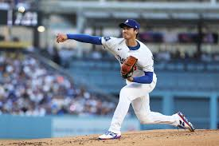

# Work 1: Examples of robots by morphology
## 1) Materials
No materials required 
## 2) Procedure

- Cartesian Robot (PPP) Write in the Blackboard
    *It is like writing your name on the blackboard using perfectly straight strokes. You move your hand left to right (X-axis), up and down (Y-axis), and you push the chalk toward or away from the board (Z-axis).

- Robot SCARA (RRP) Movement of the arm

    * It is like the movement of dealing cards on a table or wiping a stain with a cloth. The shoulder and elbow rotate on a horizontal plane, and only the wrist moves up or down to touch the table.

- Articulated Robots (RRR) Baseball pitchers
    * When throwing a ball, the arm functions as an RRR chain where the shoulder acts as the rotational base to generate power, the elbow functions as the extension joint to accelerate the forearm, and the wrist operates as the end effector, performing a rapid flick to provide direction and accuracy to the throw.

 
- ASpherical Robots (RRP) Our Shoulder

    * It can rotate side-to-side (azimuth), it can move up and down (elevation), and if you extend your arm, you can reach objects at different distances. If you keep your arm straight and move it, your hand traces the surface of an invisible sphere."

- Cylindrical Robots (RPP) Car seat
    * "A car seat, since we can move the backrest in a circular motion, and perform prismatic movements by sliding the seat forward and backward, as well as up and down.

- Delta Robots (Parallel) A fingers pianist
    * Imagine your fingertips when you try to catch a fly or the ultra-fast movement of a surgeon using tweezers. It is a 'pointing' motion where the effort comes from several tendons acting in parallel so the tip can move with incredible agility in a small space.

