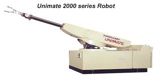
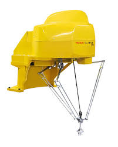

# Work 1: Examples of robots by morphology
## 1) Materials
No materials required 
## 2) Procedure

- Cartesian Robot (PPP) 3D Printers and CNC Milling Machines

    * Also known as Gantry robots. They move in straight lines, creating a rectangular workspace. They are extremely precise and easy to program. 

    Most desktop 3D printers use this setup and CNC machines large scale industrial cutting.

- Robot SCARA (RRP) Epson G-Series 

    * It is widely used in pick-and-place and electronic component assembly. It features two parallel revolute joints for the horizontal plane and one prismatic joint for vertical movement. It is the gold standard for high-speed assembly.

- Articulated Robots (RRR) KUKA KR QUANTEC

    * Three or more revolute joints (R-R-R). The most common industrial robot. It mimics the human arm (shoulder, elbow, wrist) and can reach almost any orientation. Kuka for heavy-duty welding and palletizing.

 
- ASpherical Robots (RRP) Unimate 1900

    * Two revolute joints and one prismatic (telescopic) joint. Its workspace is a section of a sphere. While less common today, it was the design of the very first industrial robots.
    Unimate 1900: The pioneer of the automotive industry.

- Cylindrical Robots (RPP) Wafer Handlers

    * One revolute joint at the base and two prismatic joints.
    The arm moves up/down and in/out while the base rotates. It creates a cylindrical workspace.
    Wafer HandleRS: Moving silicon discs in cleanrooms

- Delta Robots (Parallel) Fanuc M-1iA
    * Three parallel arms connected to a single platform. Designed for extreme speed. The heavy motors are fixed at the base, making the moving parts very light.
    Fanuc M-1iA: High-speed sorting.

