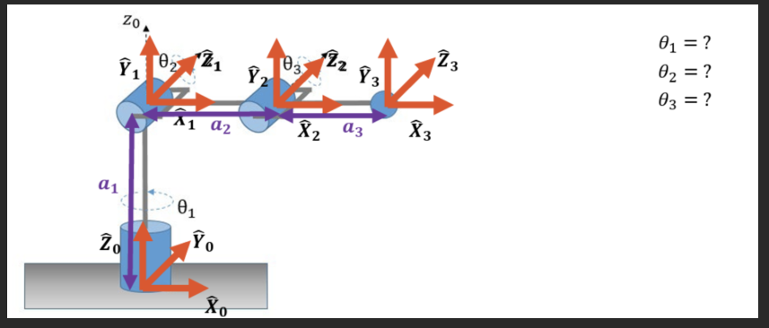
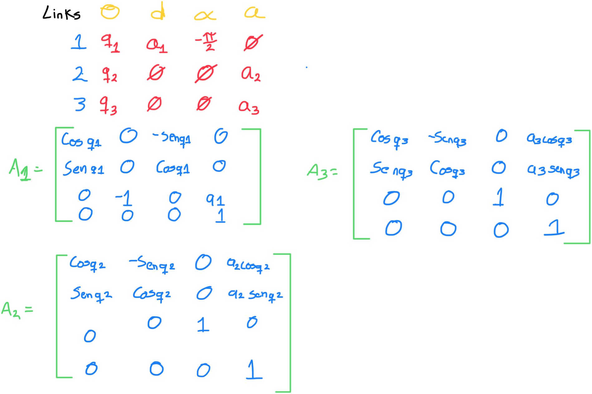
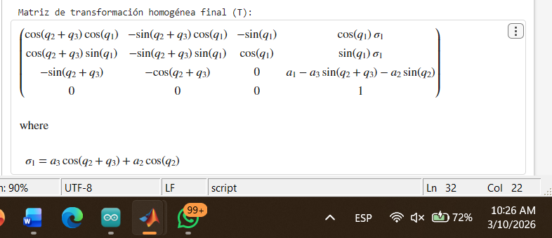
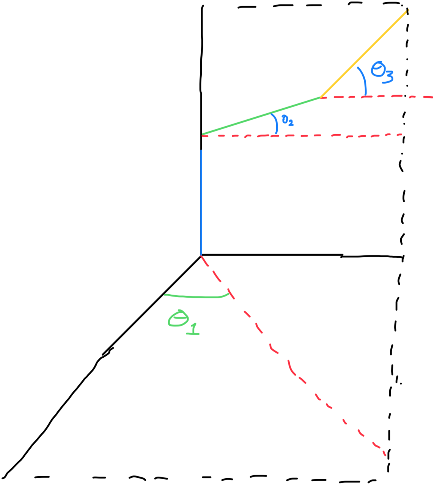
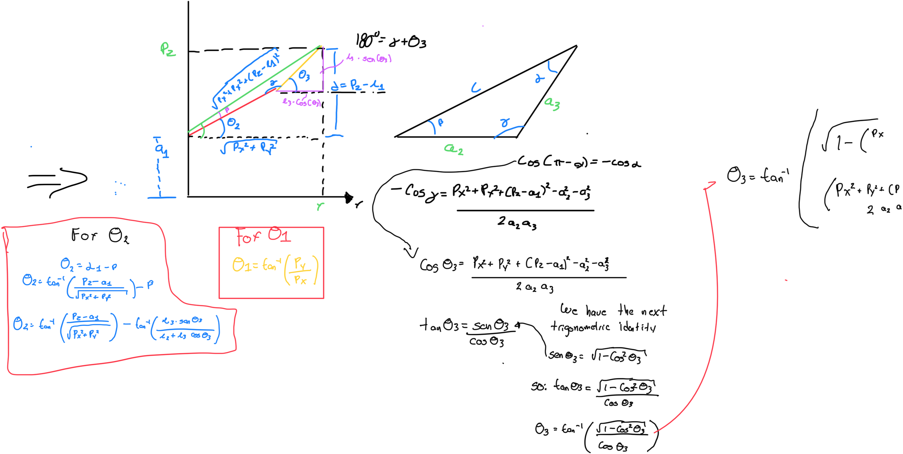

# IK and Jacobian 
## 1) Activity Goals
* Correctly assign coordinate frames to each joint following the DH convention.

* Identify the four specific parameters for each link.

* Organize the extractedvalues into a standard DH parameter table to represent the robot's kinematic structure.

* Get the DH paramaters of each robot.

* know is the kinematics of each robot.

* Know how is the movement in each joint of the kuka and ur robot, looking how is the manufacturer sets it to each positive turn.

## 2) Materials
No materials required 

## Analysis
* First we have to get the dh paramaters from the next robot: 



* We have the next DH table, where we can see all parameters: 



* After to do the table, we need the final matrix, for that we can use MatLab for do that, with the next code we can simplify the final matrix: 

```
% 1. Symbolic definitions
syms q1 q2 q3 a1 a2 a3 real

% Matrix A1
A1 = [cos(q1),  0, -sin(q1), 0;
      sin(q1),  0,  cos(q1), 0;
            0, -1,        0, a1;
            0,  0,        0, 1];

% Matrix A2
A2 = [cos(q2), -sin(q2), 0, a2*cos(q2);
      sin(q2),  cos(q2), 0, a2*sin(q2);
            0,        0, 1, 0;
            0,        0, 0, 1];

% Matrix A3
A3 = [cos(q3), -sin(q3), 0, a3*cos(q3);
      sin(q3),  cos(q3), 0, a3*sin(q3);
            0,        0, 1, 0;
            0,        0, 0, 1];

% 3. calculous of the final matrix
T = A1 * A2 * A3;

% 4. to simplify
T_simplificada = simplify(T);

% 5. show the results here
disp('Matriz de transformación homogénea final (T):');
disp(T_simplificada);

```
* With the last code we can get the final matrix for calculate the geometric method for get IK.




### Geometric Method 

* First we can simplify the robot, for do more easy the analisys for each link:



* next we can analysis from theta 3, is more easy get first the tetha 3, and then we could get theta 2 and theta 1: 



# Jacobiano