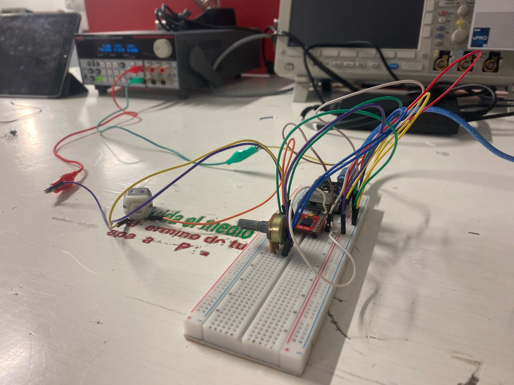
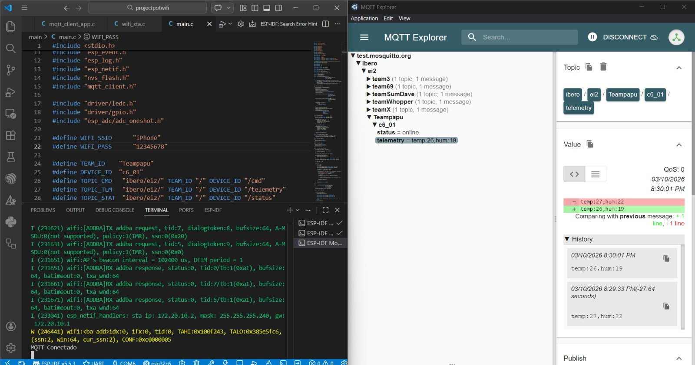
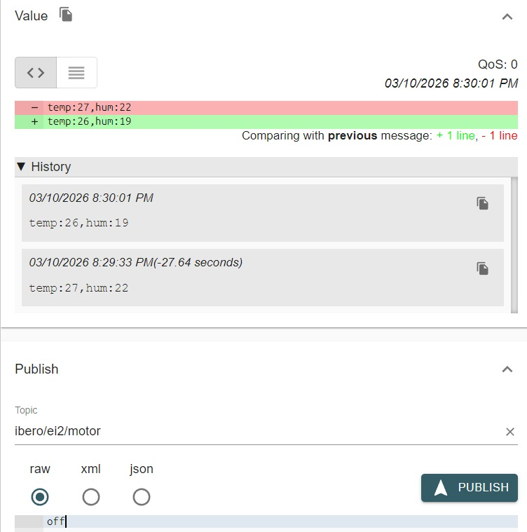

# MQTT LAB PT1
## Team 
Yahir Gil Mendoza

Isaac Aleman

Pablo Eduardo López Manzano

## 1) Activity Goals

* Interface a potentiometer with the ESP32-C6 ADC (Analog-to-Digital Converter) to capture manual control inputs.

*Develop a non-blocking execution loop to ensure simultaneous sensor reading and MQTT message handling.

* Generate a precise PWM (Pulse Width Modulation) signal to regulate the motor speed through a dedicated driver.

*Establish a secure and stable connection between the ESP32-C6 and an MQTT broker Mouitto via Wi-Fi 6.

* English: Publish real-time motor speed telemetry to a specific topic for remote monitoring.

## Materials 

* ESP32 C6 
* Cable for data 
* Protoboard
* jumpers 
* H bridge
* Motor DC 

## Analysis

### Code 1 

* The code has peripheral configuration the code utilizes the LEDC  peripheral of the ESP32-C6 to generate a high-frequency PWM signal, ensuring smooth motor rotation without audible noise.

 After the data resolution and mapping since the ESP32-C6 features a 12-bit ADC, the input signal is processed through a mapping function to match the 8-bit resolution of the PWM output
``` 
#include <stdio.h>
#include <string.h>
#include <stdlib.h>

#include "freertos/FreeRTOS.h"
#include "freertos/task.h"
#include "freertos/event_groups.h"

#include "esp_system.h"
#include "esp_wifi.h"
#include "esp_event.h"
#include "esp_log.h"
#include "esp_netif.h"
#include "nvs_flash.h"
#include "mqtt_client.h"

#include "driver/ledc.h"
#include "driver/gpio.h"
#include "esp_adc/adc_oneshot.h"

#define WIFI_SSID      "iPhone"
#define WIFI_PASS      "12345678"

#define TEAM_ID    "Teampapu"
#define DEVICE_ID  "c6_01"
#define TOPIC_CMD   "ibero/ei2/" TEAM_ID "/" DEVICE_ID "/cmd"
#define TOPIC_TLM   "ibero/ei2/" TEAM_ID "/" DEVICE_ID "/telemetry"
#define TOPIC_STAT  "ibero/ei2/" TEAM_ID "/" DEVICE_ID "/status"

// CORRECCIÓN 1: Nombres consistentes y emparejados con tu MQTT Explorer
#define TOPIC_MOTOR "ibero/ei2/motor"
#define TOPIC_SPEED "ibero/ei2/speed" 

#define ENA_GPIO   4
#define IN1_GPIO   18
#define IN2_GPIO   19

#define TEMP_ADC_CHANNEL ADC_CHANNEL_0
#define HUM_ADC_CHANNEL  ADC_CHANNEL_1

static EventGroupHandle_t wifi_event_group;
#define WIFI_CONNECTED_BIT BIT0

static const char *TAG = "IBERO_MQTT";

static esp_mqtt_client_handle_t client = NULL;

static int current_speed = 0;
static int motor_state = 0;

static void wifi_event_handler(void* arg,
                               esp_event_base_t event_base,
                               int32_t event_id,
                               void* event_data)
{
    if (event_base == WIFI_EVENT && event_id == WIFI_EVENT_STA_START)
        esp_wifi_connect();
    else if (event_base == WIFI_EVENT && event_id == WIFI_EVENT_STA_DISCONNECTED)
        esp_wifi_connect();
    else if (event_base == IP_EVENT && event_id == IP_EVENT_STA_GOT_IP)
        xEventGroupSetBits(wifi_event_group, WIFI_CONNECTED_BIT);
}

void wifi_init_sta(void)
{
    wifi_event_group = xEventGroupCreate();

    esp_netif_init();
    esp_event_loop_create_default();
    esp_netif_create_default_wifi_sta();

    wifi_init_config_t cfg = WIFI_INIT_CONFIG_DEFAULT();
    esp_wifi_init(&cfg);

    esp_event_handler_instance_register(WIFI_EVENT,
                                        ESP_EVENT_ANY_ID,
                                        &wifi_event_handler,
                                        NULL,
                                        NULL);

    esp_event_handler_instance_register(IP_EVENT,
                                        IP_EVENT_STA_GOT_IP,
                                        &wifi_event_handler,
                                        NULL,
                                        NULL);

    wifi_config_t wifi_config = {
        .sta = {
            .ssid = WIFI_SSID,
            .password = WIFI_PASS
        }
    };

    esp_wifi_set_mode(WIFI_MODE_STA);
    esp_wifi_set_config(WIFI_IF_STA, &wifi_config);
    esp_wifi_start();

    xEventGroupWaitBits(wifi_event_group,
                        WIFI_CONNECTED_BIT,
                        pdFALSE,
                        pdFALSE,
                        portMAX_DELAY);
}

static void motor_init()
{
    gpio_set_direction(IN1_GPIO, GPIO_MODE_OUTPUT);
    gpio_set_direction(IN2_GPIO, GPIO_MODE_OUTPUT);

    ledc_timer_config_t timer = {
        .speed_mode = LEDC_LOW_SPEED_MODE,
        .timer_num = LEDC_TIMER_0,
        .duty_resolution = LEDC_TIMER_8_BIT,
        .freq_hz = 5000,
        .clk_cfg = LEDC_AUTO_CLK
    };

    ledc_timer_config(&timer);

    ledc_channel_config_t channel = {
        .gpio_num = ENA_GPIO,
        .speed_mode = LEDC_LOW_SPEED_MODE,
        .channel = LEDC_CHANNEL_0,
        .timer_sel = LEDC_TIMER_0,
        .duty = 0
    };

    ledc_channel_config(&channel);
}

static void set_motor_speed(int speed)
{
    ledc_set_duty(LEDC_LOW_SPEED_MODE, LEDC_CHANNEL_0, speed);
    ledc_update_duty(LEDC_LOW_SPEED_MODE, LEDC_CHANNEL_0);
}

static void motor_forward()
{
    gpio_set_level(IN1_GPIO, 1);
    gpio_set_level(IN2_GPIO, 0);
}

static void motor_stop()
{
    gpio_set_level(IN1_GPIO, 0);
    gpio_set_level(IN2_GPIO, 0);
    set_motor_speed(0);
}

static void sensor_task(void *pv)
{
    adc_oneshot_unit_handle_t adc_handle;

    adc_oneshot_unit_init_cfg_t init_config = {
        .unit_id = ADC_UNIT_1,
    };

    adc_oneshot_new_unit(&init_config, &adc_handle);

    adc_oneshot_chan_cfg_t config = {
        .bitwidth = ADC_BITWIDTH_DEFAULT,
        .atten = ADC_ATTEN_DB_12,
    };

    adc_oneshot_config_channel(adc_handle, TEMP_ADC_CHANNEL, &config);
    adc_oneshot_config_channel(adc_handle, HUM_ADC_CHANNEL, &config);

    int last_temp = -100;
    int last_hum = -100;

    while (1)
    {
        int raw_temp;
        int raw_hum;

        adc_oneshot_read(adc_handle, TEMP_ADC_CHANNEL, &raw_temp);
        adc_oneshot_read(adc_handle, HUM_ADC_CHANNEL, &raw_hum);

        int temperature = (raw_temp * 50) / 4095;
        int humidity = (raw_hum * 100) / 4095;

        if (abs(temperature - last_temp) >= 3 || abs(humidity - last_hum) >= 3)
        {
            printf("Temperatura: %d °C\n", temperature);
            printf("Humedad: %d %%\n", humidity);

            char msg[64];
            sprintf(msg, "temp:%d,hum:%d", temperature, humidity);

            if (client != NULL)
                esp_mqtt_client_publish(client, TOPIC_TLM, msg, 0, 1, 0);

            last_temp = temperature;
            last_hum = humidity;
        }

        vTaskDelay(pdMS_TO_TICKS(300));
    }
}

static void mqtt_event_handler(void *handler_args,
                               esp_event_base_t base,
                               int32_t event_id,
                               void *event_data)
{
    esp_mqtt_event_handle_t event = event_data;

    switch (event->event_id)
    {

    case MQTT_EVENT_CONNECTED:

        printf("MQTT Conectado\n");

        esp_mqtt_client_subscribe(client, TOPIC_CMD, 1);
        esp_mqtt_client_subscribe(client, TOPIC_MOTOR, 1);
        esp_mqtt_client_subscribe(client, TOPIC_SPEED, 1);

        esp_mqtt_client_publish(client, TOPIC_STAT, "online", 0, 1, 0);

        break;

    case MQTT_EVENT_DATA:

        printf("Topic=%.*s Data=%.*s\n",
               event->topic_len, event->topic,
               event->data_len, event->data);

        if (strncmp(event->topic, TOPIC_MOTOR, event->topic_len) == 0)
        {
            if (strncmp(event->data, "ON", event->data_len) == 0 || strncmp(event->data, "on", event->data_len) == 0)
            {
                motor_state = 1;
                motor_forward();
                set_motor_speed(current_speed);
            }
            else if (strncmp(event->data, "OFF", event->data_len) == 0 || strncmp(event->data, "off", event->data_len) == 0)
            {
                motor_state = 0;
                motor_stop();
            }
        }

        if (strncmp(event->topic, TOPIC_SPEED, event->topic_len) == 0)
        {
            int speed = atoi(event->data);

            if (speed >= 0 && speed <= 255)
            {
                current_speed = speed;

                if (motor_state)
                    set_motor_speed(speed);
            }
        }

        break;

    case MQTT_EVENT_DISCONNECTED:

        printf("MQTT Desconectado\n");

        break;

    default:
        break;
    }
}

void mqtt_app_start(const char *broker_uri)
{
    motor_init();

    xTaskCreate(sensor_task, "sensor_task", 4096, NULL, 5, NULL);

    esp_mqtt_client_config_t cfg = {
        .broker.address.uri = broker_uri,
        .session.keepalive = 30
    };

    client = esp_mqtt_client_init(&cfg);

    esp_mqtt_client_register_event(client,
                                   ESP_EVENT_ANY_ID,
                                   mqtt_event_handler,
                                   NULL);

    esp_mqtt_client_start(client);
}

void app_main(void)
{
    nvs_flash_init();
    wifi_init_sta();
    mqtt_app_start("mqtt://test.mosquitto.org:1883");
}

``` 
* The speed value is converted from an integer to a string using dtostrf() before being published to the MQTT broker to allow real-time dashboard visualization.

## Results 

* First we have the next circuit 



* Our code runs and the page for MQTT



* Mqtt runs 



### Video

[MQTT](https://youtu.be/hpEJd5n-EJY)
