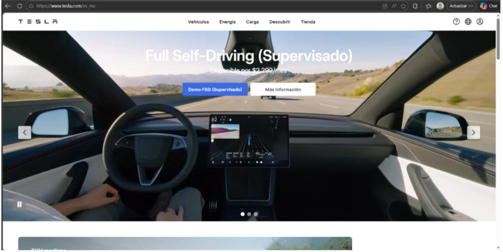
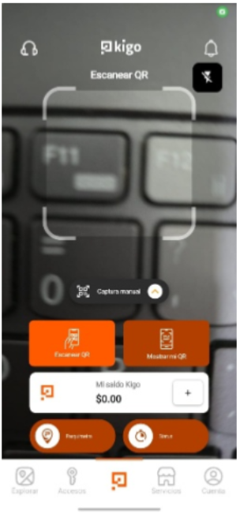

# Prototipado de la landing page del proyecto final

## Team 
* Pablo Eduardo López Manzano
* Emmanuel Angeles Barreto
* Jesus Cerezo Ponce 
## BENCHMARK DE REFERENCIAS
### Spotify

* La página inicia con la música tuya, la información está clara, la música que escuchas esta al principio e igual te da la todo claro para que puedas encontrar lo que busques. El inicio, búsqueda, biblioteca y crear son algunas de las secciones más visibles al entrar a la aplicación. Ellos utilizan colores como verde y negro, fotografías de artistas, álbumes y demás. Es muy fácil de usar, además de que el registro a esta es fácil.

### Tesla 

* La página inicia con algún producto que llama la atención, alguna tecnología de ellos, esto hace que llame la atención del comprador, también algunos productos que venden. Los botones que te llevan a algún lado de lo que tienen esta al costado y lo tiene separados por categorías. El menú cuenta con todas las secciones que tienen. Las fotografías de los vehículos son grandes pero la página es minimalista ya que no cuenta con una gran cantidad de cosas que el usuario podrías hacer, cuenta con lo necesario. El diseño es simple pero eficaz.

### Kigo 

* La página inicia con lo que tiene, abajo tiene lo que se puede ocupar, las secciones son Explorar, accesos, escanear QR, servicios y cuenta por lo que es fácil de ocuparla. Estacionarse y registrarse al entrar a algún lugar de manera rápida. Es fácil de ocupar la aplicación.

## Descripcion del proyecto 
* ParkSmart busca resolver el problema de la dificultad para encontrar estacionamiento en lugares con alta demanda, como universidades o centros comerciales. La plataforma permitirá visualizar en tiempo real los espacios de estacionamiento disponibles mediante un mapa digital, facilitando a los conductores encontrar un lugar rápidamente y reduciendo el tráfico generado por la búsqueda de estacionamiento.

El sistema esta dirigido para los estudiantes, profesores y visitantes de universidad que necesitan encontrar estacionamiento de manera rápida y sencilla. También puede ser útil para administradores de estacionamientos que buscan mejorar la organización y control de los espacios disponibles.

### Mapa de navegación 
* Inicio / Mapa

· Ver lugares disponibles: Muestra cajones libres resaltados en verde sobre el mapa.

· Ver lugares ocupados: Muestra cajones tomados resaltados en rojo.

· Registrar espacio ocupado: El usuario puede marcar manualmente un cajón como ocupado desde el mapa.

* Registrar estacionamiento

· Marcar lugar ocupado: Selecciona un cajón en el mapa y lo registra como tomado.

· Marcar lugar libre: Actualiza el estado de un cajón a disponible cuando el usuario sale.

· Confirmar registro: Pantalla de confirmación antes de enviar el cambio de estado.

* Mi actividad

· Historial de lugares registrados: Lista cronológica de los cajones que el usuario ha registrado.

· Estado actual del estacionamiento: Vista rápida del número de lugares libres y ocupados en ese momento.

* Servicios

· Información del estacionamiento: Capacidad total, zonas, niveles y datos generales del estacionamiento.

· Reglas y horarios: Normativa de uso, horarios de apertura y restricciones por zona.

· Ayuda: Preguntas frecuentes, contacto de soporte y reporte de errores.

* Cuenta

· Perfil: Nombre del usuario, correo institucional, foto y datos personales.
## Landing 

[Video de la app modo ediccion y usuario final](https://youtu.be/YALPJq6DTa0)

