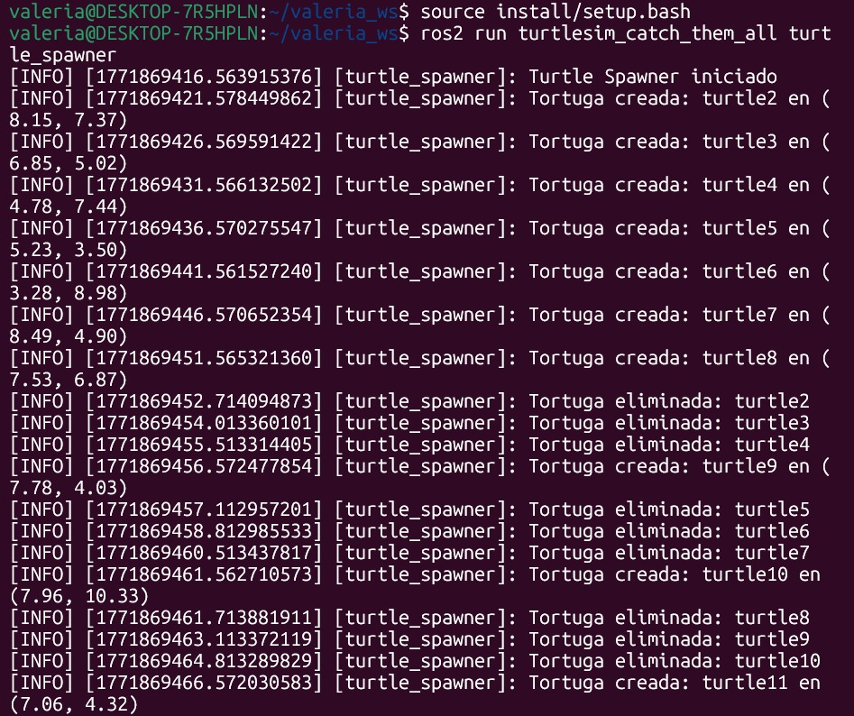

# Work Ros Basics Capstone
## Team 
Valeria Barroso Huitrón
Carlos Sebastian Eugenio Reyes
Pablo Eduardo López Manzano

## 1) Activity Goals

* Create and integrate custom message interfaces like Turtle.msg and TurtleArray.msg. Develop a custom service interface, CatchTurtle.srv, with specific request and response structures

* Build a multi-node ROS 2 application to visualize behavior using the turtlesim package. Design the architecture first to outline the nodes, topics, and services.

* Implement a high-rate control loop in the turtle_controller using a simplified PI controller to drive the turtle to its target.

* Program a turtle_spawner to call the /spawn service for generating turtles at random coordinates. Provide a /catch_turtle service that calls the /kill service and removes caught turtles from an actively maintained list.

## 2) Materials
No materials required 
## Analysis

### Code 1

* This Python script defines the TurtleSpawner node, which is responsible for generating new turtles at random intervals and managing the list of currently active turtles in the simulation.

* It creates two service clients to communicate with the main turtlesim node: spawn for create turtles and /kill for remove the turtles

```
turtle_spawner.py:
#!/usr/bin/env python3

import rclpy
import random
from rclpy.node import Node
from turtlesim.srv import Spawn, Kill
from my_robot_interfaces.msg import Turtle, TurtleArray
from my_robot_interfaces.srv import CatchTurtle


class TurtleSpawner(Node):

    def __init__(self):
        super().__init__('turtle_spawner')

        # Clientes
        self.spawn_client = self.create_client(Spawn, '/spawn')
        self.kill_client = self.create_client(Kill, '/kill')

        # Publisher
        self.publisher_ = self.create_publisher(
            TurtleArray,
            '/alive_turtles',
            10
        )

        # Servicio personalizado
        self.service = self.create_service(
            CatchTurtle,
            '/catch_turtle',
            self.catch_turtle_callback
        )

        self.alive_turtles = []

        # Timer para spawnear cada 5 segundos
        self.timer = self.create_timer(5.0, self.spawn_turtle)

        self.get_logger().info("Turtle Spawner iniciado")

    def spawn_turtle(self):

        if not self.spawn_client.wait_for_service(timeout_sec=1.0):
            self.get_logger().warn("Servicio /spawn no disponible")
            return

        # Generar coordenadas aleatorias
        x = random.uniform(0.5, 10.5)
        y = random.uniform(0.5, 10.5)
        theta = random.uniform(0.0, 6.28)

        request = Spawn.Request()
        request.x = x
        request.y = y
        request.theta = theta

        future = self.spawn_client.call_async(request)

        # Guardar también las coordenadas reales
        future.add_done_callback(
            lambda future: self.spawn_done(future, x, y, theta)
        )

    def spawn_done(self, future, x, y, theta):

        try:
            response = future.result()
        except Exception as e:
            self.get_logger().error(f"Error al spawnear: {e}")
            return

        turtle = Turtle()
        turtle.name = response.name
        turtle.x = x
        turtle.y = y
        turtle.theta = theta

        self.alive_turtles.append(turtle)

        self.publish_alive_turtles()

        self.get_logger().info(f"Tortuga creada: {turtle.name} en ({x:.2f}, {y:.2f})")

    def publish_alive_turtles(self):

        msg = TurtleArray()
        msg.turtles = self.alive_turtles
        self.publisher_.publish(msg)

    def catch_turtle_callback(self, request, response):

        if not self.kill_client.wait_for_service(timeout_sec=1.0):
            response.success = False
            return response

        kill_request = Kill.Request()
        kill_request.name = request.name

        self.kill_client.call_async(kill_request)

        # Eliminar de la lista
        self.alive_turtles = [
            t for t in self.alive_turtles
            if t.name != request.name
        ]

        self.publish_alive_turtles()

        self.get_logger().info(f"Tortuga eliminada: {request.name}")

        response.success = True
        return response


def main(args=None):
    rclpy.init(args=args)
    node = TurtleSpawner()
    rclpy.spin(node)
    rclpy.shutdown()

```
* Every 5 seconds, it generates random x and y coordinates between 0.5 and 10.5, and a random angle theta. 

* The spawner then calls the /kill service to visually remove it from the turtlesim window.

* It filters the internal alive_turtles list to remove the caught turtle.

* Finally, it republishes the updated /alive_turtles list so the controller knows to pick a new target.

## Code 2
* The turtle_controller.py node acts as the hunter. Its main goal is to calculate the trajectory toward the nearest target and move turtle1 accordingly.
* The code calculates the distance to the target using the Pythagorean theorem: distance = sqrt(dx^2 + dy^2). It also calculates the angle using
* It then sends an asynchronous request to the /catch_turtle service so the spawner can remove it from the map. 
```
turtle_controller.py:
#!/usr/bin/env python3

import rclpy
import math
from rclpy.node import Node
from geometry_msgs.msg import Twist
from turtlesim.msg import Pose
from my_robot_interfaces.msg import TurtleArray
from my_robot_interfaces.srv import CatchTurtle


class TurtleController(Node):

    def __init__(self):
        super().__init__('turtle_controller')

        self.pose = None
        self.target = None

        self.create_subscription(
            Pose,
            '/turtle1/pose',
            self.pose_callback,
            10
        )

        self.create_subscription(
            TurtleArray,
            '/alive_turtles',
            self.alive_callback,
            10
        )

        self.publisher_ = self.create_publisher(
            Twist,
            '/turtle1/cmd_vel',
            10
        )

        self.client = self.create_client(
            CatchTurtle,
            '/catch_turtle'
        )

        self.timer = self.create_timer(0.1, self.control_loop)

    def pose_callback(self, msg):
        self.pose = msg

    def alive_callback(self, msg):
        if len(msg.turtles) > 0:
            self.target = msg.turtles[0]
        else:
            self.target = None

    def control_loop(self):

        if self.pose is None or self.target is None:
            return

        dx = self.target.x - self.pose.x
        dy = self.target.y - self.pose.y

        distance = math.sqrt(dx*dx + dy*dy)
        angle = math.atan2(dy, dx)

        cmd = Twist()

        cmd.linear.x = 2.0 * distance
        cmd.angular.z = 6.0 * (angle - self.pose.theta)

        self.publisher_.publish(cmd)

        if distance < 0.3:
            request = CatchTurtle.Request()
            request.name = self.target.name
            self.client.call_async(request)


def main(args=None):
    rclpy.init(args=args)
    node = TurtleController()
    rclpy.spin(node)
    rclpy.shutdown()
```
### Images
* termianl 1:
ros2 run turtlesim turtlesim_node


* terminal 2:
ros2 run turtlesim_catch_them_all turtle_spawner




* terminal 3:
ros2 run turtlesim_catch_them_all turtle_controller


* TurtleSim program runs


## RESUTLS
* link del video 
https://youtu.be/yMs9FbAgi54
