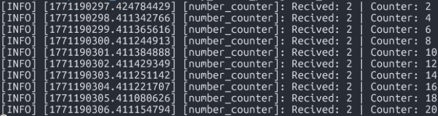

# Ros2 Service Server 
## 1) Activity Goals
* Add a functionality to reset the counter to zero.

* Create a Service Server: Create a service server inside the existing number_counter node.

* Name the service /reset_counter.

* Service Type: Use the pablo_interfaces/srv/SetBool type.

* When the server is called, check the boolean data from the request; if it is true, set the counter variable to 0.

* Call the service directly from the command line.

* Create a custom node to call the /reset_counter service for extra practice.

## 2) Materials
No materials required 
## 3) Code
### This code of LAb 01

We star with the configuration of the interface with the next codes. 

``` 
pablo_interfaces/srv/SetBool

```

### Imports 
For this step we have the next imports:
``` 
import rclpy
from rclpy.node import Node
from pablo_interfaces.msg import Int64 
from pablo_interfaces.srv import SetBool

```
### Package
In this part we have to add the package in our package. xml:
``` 
<?xml version="1.0"?>
<?xml-model href="http://download.ros.org/schema/package_format3.xsd" schematypens="http://www.w3.org/2001/XMLSchema"?>
<package format="3">
  <name>my_robot</name>
  <version>0.0.0</version>
  <description>TODO: Package description</description>
  <maintainer email="pablo_pablo_@todo.todo">pablo_pablo_</maintainer>
  <license>TODO: License declaration</license>
  <depend>example_interfaces</depend>
  <depend>rclp</depend>
  <depedn>my_robot</depend>
  <depend>pablo_interfaces</depend>

  <test_depend>ament_copyright</test_depend>
  <test_depend>ament_flake8</test_depend>
  <test_depend>ament_pep257</test_depend>
  <test_depend>python3-pytest</test_depend>
  
  <export>
    <build_type>ament_python</build_type>
  </export>
</package>

```
### Define trhe node 
In this step we will create the node class and its named:

```
class pabloCounter(Node):
    def __init__(self):
        #Initialize node with the name "pablo_counter"
        super().__init__("pablo_counter")

```
### Callback

Now we create the callback of the function:
The callback evaluates the boolean request.data:
With the next code it will do: 
If True: It resets the counter to 0, logs the event, and returns a success response (True) with a confirmation message.

If False: It takes no action and returns a response indicating the reset was not performed (False).

```
# Service callback for /reset_counter
    def read_bool_callback(self, request, response):
        # Boolean condition if request.data is true, reset the counter to 0.
        if request.data:
            # reset counter
            self.counter = 0;
            #Indicates succesful reset
            response.success = True
            response.message = "Counter reset to 0"
            # Log reset event
            self.get_logger().info("Counter restarted to 0")
        else:
            # No reset performed
            response.success = False
            response.message = "Counter not reset"
        return response
```
### Code 
```
#!/usr/bin/env python3
import rclpy
from rclpy.node import Node
from pablo_interfaces.msg import Int64 
from pablo_interfaces.srv import SetBool

class numCounter(Node):
    def __init__(self):
        #Initialize node with the name "number_counter"
        super().__init__("pablo_counter")
        self.server_ = self.create_service(SetBool, "/reset_counter",self.read_bool_callback) # Creats a service server type SetBool. It needs: (Service type, service name, callback function)
        self.counter = 0 # Start the counter on 0
        self.subscriber = self.create_subscription(Int64,"/number", self.callback_receive_info,10) # (Type, topic name, callback function, queue size)
        self.publisher = self.create_publisher(Int64,"/number_count",10) # (Type, topic name, queue size)

    #Subscriber callback. Triggers every time a message is received on /number. Adds the received value to the internal counter and publishes the updated total.
    def callback_receive_info(self, msg: Int64): #its receiving a msg of type String
        # Acumulate recived value
        self.counter += msg.data
        # Create message to publish
        out_msg = Int64()
        out_msg.data = self.counter
        #Log received value and current counter state
        self.get_logger().info(f"Recived: {msg.data} | Counter: {self.counter}") #print the data field
        #Published updated counter value
        self.publisher.publish(out_msg)

    # Service callback for /reset_counter. If request.data is true, reset the counter to 0.
    def read_bool_callback(self, request, response):
        # Boolean condition
        if request.data:
            # reset counter
            self.counter = 0;
            #Indicates succesful reset
            response.success = True
            response.message = "Counter reset to 0"
            # Log reset event
            self.get_logger().info("Counter restarted to 0")
        else:
            # No reset performed
            response.success = False
            response.message = "Counter not reset"
        return response

def main(args=None):
    rclpy.init(args=args) # Initialize rclpy
    counter_node = numCounter() # Create node instance
    rclpy.spin(counter_node) # Keep the node alive and processing callbacks
    rclpy.shutdown()      # Shutdown rclpy

if __name__ == "__main__":
    main()

```
### Add to setup.py

```
from setuptools import find_packages, setup
package_name = 'my_robot'

setup(
    name=package_name,
    version='0.0.0',
    packages=find_packages(exclude=['test']),
    data_files=[
        ('share/ament_index/resource_index/packages',
            ['resource/' + package_name]),
        ('share/' + package_name, ['package.xml']),
    ],
    install_requires=['setuptools'],
    zip_safe=True,
    maintainer='pablo_pablo_',
    maintainer_email='pablo_pablo_@todo.todo',
    description='TODO: Package description',
    license='TODO: License declaration',
    extras_require={
        'test': [
            'pytest',
        ],
    },
    entry_points={
        'console_scripts': [
            'C3P0 = my_robot.my_first_node:main',
            'number_publisher = my_robot.number_publisher:main',
            'number_counter = my_robot.number_counter:main',
            'c3p0 = my_robot.c3p0:main',
            'publisher = my_robot.publisher:main',
            'listener=my_robot.listener:main',  
            'todayclas = my_robot.todayclas:main',
            'status_pub = my_robot.status_pub:main',
            'num_publisher = my_robot.number_publisher:main',
            'num_counter = my_robot.number_counter:main', 

        ]
    }

)

```
### Run code 
First we have the code of counter and publisher:

code for run in ubuntu terminal the publisher : 
```
ros2 run <your_package_name> <your_publisher_node_name>
```
And the code for run counter
```
ros2 run <your_package_name> <your_publisher_node_name>
```



Then we try the reset with the function created before
```
ros2 service call /<name of your service server> pablo_interfaces/srv/SetBool "{data: false}"
```

