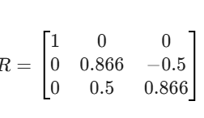
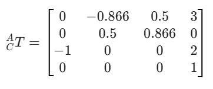

# Work 2: Transform Nomenclature
## 1) Activity Goals
1. Understand the mathematical representation of point rotations in space.
2. Apply the left-multiplication rule for rotations about fixed reference axes.
Perform visual analysis of geometric diagrams to extract spatial data.
5. Integrate rotation and translation vectors into a single coordinate frame.
## 2) Materials
No materials required 
## 3) Analysis
### Exercise 1
First Rotation in YA with angle= 45 degrees

Second Rotation in Xa angle = 60 degrees

### Exercise 2
the frame B is rotating relative to A in X with angle = 30 degrees, with ApB origin = [5 10 0]
The rotation in X :
we have an angle = 30 degrees

We have to make the final matrix: 

### Exercise 3
For A-B T we have our origin in APB origin [ 3 0 0]
so for our first traslation we have:

For our second matrix, we have to deternimate the rotation of C relative to A, we have the origin of C in [3 0 2], so:

