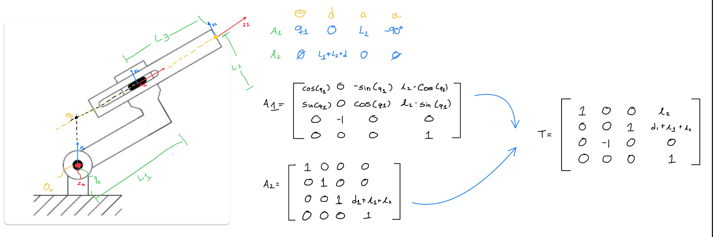
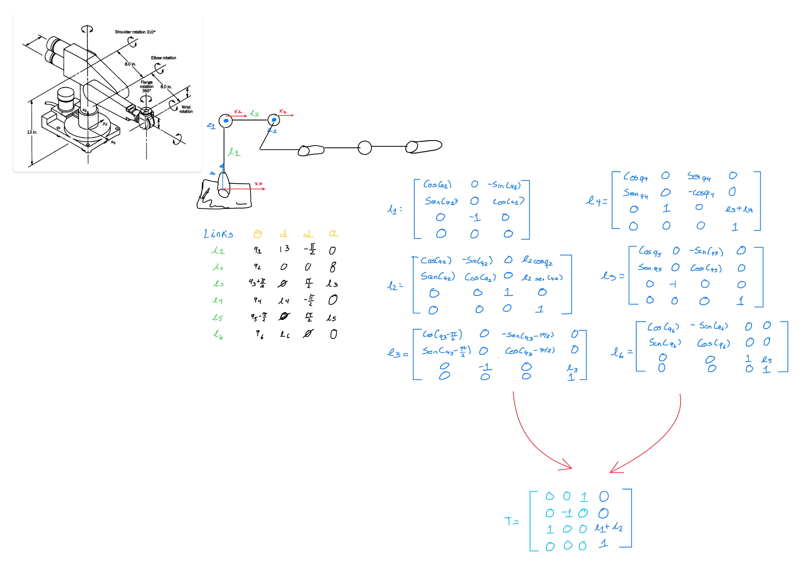
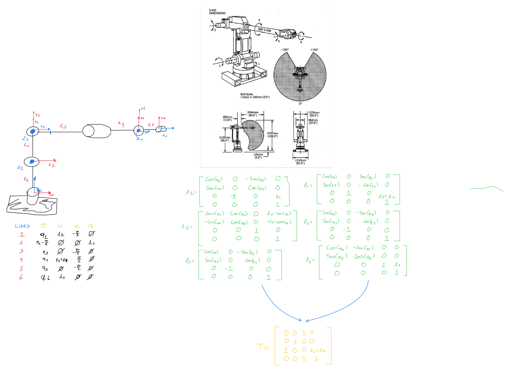
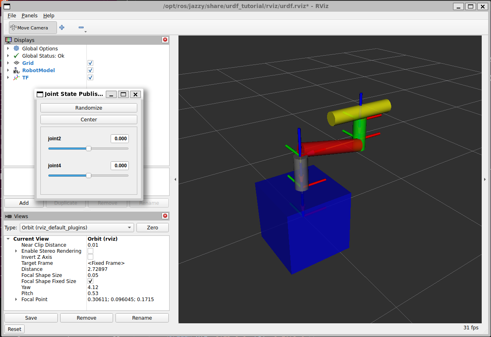
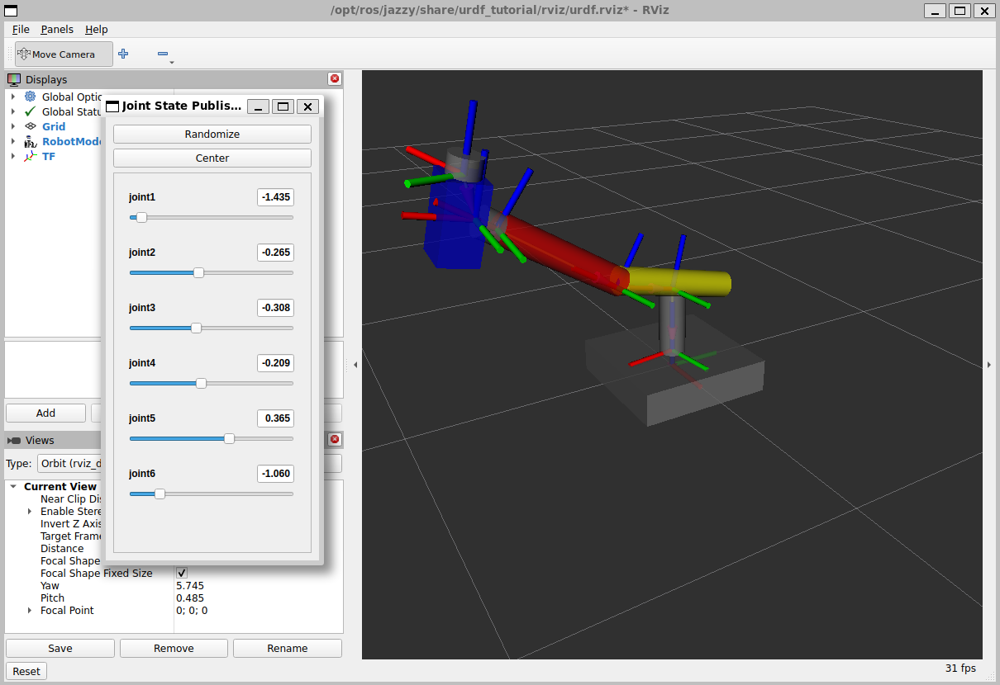
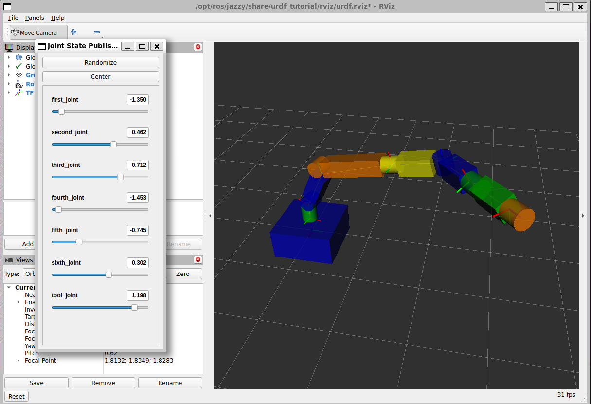

# URDF Robots
## Team 
Valeria Barroso Huitrón
Carlos Sebastian Eugenio Reyes
Pablo Eduardo López Manzano

## 1) Activity Goals

* Analyze existing robot examples to identify the kinematic chain, distinguishing between links of our rigid bodies and joints of each revolute or prismatic move of the robot.

* Assign coordinate frames to each joint according to Denavit-Hartenberg conventions and calculate the four parameters theta, d, a, alpha for every degree of freedom.

* Formulate the transformation matrices to verify that the mathematical model correctly represents the robot's workspace and end-effector position.

* Translate the DH table into a URDF file, defining the link and joint tags with their respective spatial offsets and rotation axis.
* Launch the robot model in RViz to validate the coordinate transforms (TF tree) and test joint movements.

## 2) Materials
No materials required 

## Analysis

### Robot 1

We have the next robot and the DH parameters.



For this robot we have the next code for simulate in RVIZ:

* This robot has 2 grades of freedom each move is a revolution a prismatic.

```
<?xml version="1.0"?>

<robot name="my_robot" >
    <link name="base_link">
        <visual>
            <geometry>
                <box size="0.5 0.5 0.5"/>
            </geometry>
            <origin xyz="0 0 0" rpy="0 0 0"/>
            <material name="blue">
                <color rgba="0 0 1 1"/>
            </material>
        </visual>
    </link>

    <link name="support_link">
        <visual>
            <geometry>
                <cylinder length="0.25" radius="0.05"/>
            </geometry>
            <origin xyz="0 0 0.125" rpy="0 0 0"/>
            <material name="gray">
                <color rgba="0.5 0.5 0.5 1"/>
            </material>
        </visual>
    </link>

    <link name="arm1_link">
    <visual>
        <geometry>
            <cylinder length="0.5" radius="0.05"/>
        </geometry>
        <origin xyz="0.25 0 0" rpy="0 1.75 0"/>
        <material name="red">
            <color rgba="1 0 0 1"/>
        </material>
        </visual>
    </link>

    <link name="arm2_link">
        <visual>
            <geometry>
                <cylinder length="0.25" radius="0.05"/>
            </geometry>
            <origin xyz="0 0 0.05" rpy="0 0 0"/>
            <material name="green">
                <color rgba="0 1 0 1"/>
            </material>
        </visual>
    </link>

    <link name="arm3_link">
        <visual>
            <geometry>
                <cylinder length="0.5" radius="0.05"/>
            </geometry>
            <origin xyz="0 0 0.0625" rpy="0 1.57 0"/>
            <material name="yellow">
                <color rgba="1 1 0 1"/>
            </material>
        </visual>
    </link>
    <joint name="joint1" type="fixed">
        <origin xyz="0 0 0.25" rpy="0 0 0"/>
        <parent link="base_link"/>
        <child link="support_link"/>
        <axis xyz="0 0 1"/>
        <limit lower="-1.57" upper="1.57" effort="100" velocity="100"/>
    </joint>

    <joint name="joint2" type="revolute">
        <origin xyz="0 0 0.25" rpy="0 0 0"/>
        <parent link="support_link"/>
        <child link="arm1_link"/>
        <axis xyz="0 -1 0"/>
        <limit lower="-1.57" upper="1.57" effort="100" velocity="100"/>
    </joint>

    <joint name="joint3" type="fixed">
        <origin xyz="0.5 0 0" rpy="0 0 0"/>
        <parent link="arm1_link"/>
        <child link="arm2_link"/>
        <axis xyz="0 0 1"/>
        <limit lower="-1.57" upper="1.57" effort="100" velocity="100"/>
    </joint>

    <joint name="joint4" type="prismatic">
        <origin xyz="0 0 0.15" rpy="0 0 0"/>
        <parent link="arm2_link"/>
        <child link="arm3_link"/>
        <axis xyz="1 0 0"/>
        <limit lower="-1.57" upper="1.57" effort="100" velocity="100"/>
    </joint>

</robot>

```

### Robot 4

We have the next robot and the DH parameters.



For this robot we have the next code for simulate in RVIZ:

* This robot has 6 grades of freedom each move is a revolution. 

```
<?xml version="1.0"?>

<robot name="my_robot" >
    <link name="base_link">
        <visual>
            <geometry>
                <box size="0.5 0.5 0.125"/>
            </geometry>
            <origin xyz="0 0 0" rpy="0 0 0"/>
            <material name="green">
                <color rgba="0.5 0.5 0.5 1"/>
            </material>
        </visual>
    </link>

    <link name="rotationBase_link">
        <visual>
            <geometry>
                <cylinder length="0.25" radius="0.05"/>
            </geometry>
            <origin xyz="0 0 0.125" rpy="0 0 0"/>
            <material name="gray">
                <color rgba="0.5 0.5 0.5 1"/>
            </material>
        </visual>
    </link>

    <link name="Sholder_link">
        <visual>
            <geometry>
                <cylinder length="0.5" radius="0.05"/>
            </geometry>
            <origin xyz="0 0 0.025" rpy="0 1.57 0"/>
            <material name="yellow">
                <color rgba="1 1 0 1"/>
            </material>
        </visual>
    </link>

    <link name="arm1_link">
        <visual>
            <geometry>
                <cylinder length="0.5" radius="0.05"/>
            </geometry>
            <origin xyz="0.25 0 0.02" rpy="0 1.57 0"/>
            <material name="red">
                <color rgba="1 0 0 1"/>
            </material>
        </visual>
    </link>

    <link name="rotation1_link">
        <visual>
            <geometry>
                <cylinder length="0.06" radius="0.05"/>
            </geometry>
            <origin xyz="0.03 0 0" rpy="0 1.57 0"/>
            <material name="green">
                <color rgba="0 1 0 1"/>
            </material>
        </visual>
    </link>

    <link name="rotation2_link">
        <visual>
            <geometry>
                <box size="0.125 0.25 0.125"/>
            </geometry>
            <origin xyz="0.05 0 0" rpy="1.57 0 0"/>
            <material name="blue">
                 <color rgba="0 0 1 1"/>
            </material>
        </visual>
    </link>

    <link name="rotation3_link">
        <visual>
            <geometry>
                <cylinder length="0.06" radius="0.05"/>
            </geometry>
            <origin xyz="0 0 0.03" rpy="0 0 1.57"/>
            <material name="green">
                <color rgba="0 1 0 1"/>
            </material>
        </visual>
    </link>
    <joint name="joint1" type="revolute">
        <origin xyz="0 0 0.0625" rpy="0 0 0"/>
        <parent link="base_link"/>
        <child link="rotationBase_link"/>
        <axis xyz="0 0 1"/>
        <limit lower="-1.57" upper="1.57" effort="100" velocity="100"/>
    </joint>
     
     <joint name="joint2" type="revolute">
        <origin xyz="0 0 0.25" rpy="0 0 0"/>
        <parent link="rotationBase_link"/>
        <child link="Sholder_link"/>
        <axis xyz="0 1 0"/>
        <limit lower="-1.57" upper="1.57" effort="100" velocity="100"/>
    </joint>

    <joint name="joint3" type="revolute">
        <origin xyz="0.25 0 0" rpy="0 0 0"/>
        <parent link="Sholder_link"/>
        <child link="arm1_link"/>
        <axis xyz="0 1 0"/>
        <limit lower="-1.57" upper="1.57" effort="100" velocity="100"/>
    </joint>
    
    <joint name="joint4" type="revolute">
        <origin xyz="0.5 0 0.015" rpy="0 0 0"/>
        <parent link="arm1_link"/>
        <child link="rotation1_link"/>
        <axis xyz="1 0 0"/>
        <limit lower="-1.57" upper="1.57" effort="100" velocity="100"/>
    </joint>

    <joint name="joint5" type="revolute">
        <origin xyz="0.075 0 0" rpy="0 0 0"/>
        <parent link="rotation1_link"/>
        <child link="rotation2_link"/>
        <axis xyz="0 1 0"/>
        <limit lower="-1.57" upper="1.57" effort="100" velocity="100"/>
    </joint>

    <joint name="joint6" type="revolute">
        <origin xyz="0.05 0 0.125" rpy="3.14 3.14 3.14"/>
        <parent link="rotation2_link"/>
        <child link="rotation3_link"/>
        <axis xyz="0 0 1"/>
        <limit lower="-1.57" upper="1.57" effort="100" velocity="100"/>
    </joint>

</robot>

```

### Robot 5

We have the next robot and the DH parameters.



For this robot we have the next code for simulate in RVIZ:

* This robot has 6 grades of freedom each move is a revolution. 

```
<?xml version="1.0"?>

<robot name="my_robot">

<material name="blue">
    <color rgba="0 0 0.8 1"/>
  </material>

  <material name="green">
    <color rgba="0 0.8 0 1"/>
  </material>

  <material name="orange">
    <color rgba="1 0.5 0 1"/>
  </material>

  <material name="yellow">
    <color rgba="1 1 0 1"/>
  </material>

  <link name="base_link">
    <visual>
      <geometry>
        <box size="1 1 .5"/>
      </geometry>
      <origin xyz="0 0 0" rpy="0 0 0"/>
      <material name="blue"/>
    </visual>
  </link>

  <link name="second_link">
    <visual>
      <geometry>
        <cylinder radius="0.125" length=".250"/>
      </geometry>
      <origin xyz="0 0 -0.125" rpy="0 0 0"/>
      <material name="green"/>
    </visual>
  </link>

  <link name="third_link">
    <visual>
      <geometry>
        <cylinder radius="0.125" length="0.25"/>
      </geometry>
      <origin xyz="0 0.125 0" rpy="0 0 0"/>
      <material name="blue"/>
      </visual>
       <visual>
      <geometry>
        <box size="0.25 0.5 0.25"/>
      </geometry>
      <origin xyz="0 .5 0" rpy="0 0 0"/>
      <material name="green"/>
    </visual>
  </link>

  <link name="fourth_link">
    <visual>
      <geometry>
        <cylinder radius="0.125" length=".250"/>
      </geometry>
      <origin xyz="0 0.125 0" rpy="0 0 0"/>
      <material name="orange"/>
      </visual>
      <visual>
      <geometry>
        <box size="1 0.25 0.25"/>
      </geometry>
      <origin xyz="0.625 0.125 0" rpy="0 0 0"/>
      <material name="green"/>
    </visual>
    </link>
 <link name="fifth_link">
    <visual>
      <geometry>
        <cylinder radius="0.125" length=".250"/>
      </geometry>
      <origin xyz="0 0 0" rpy="0 0 0"/>
      <material name="yellow"/>
      </visual>
      <visual>
      <geometry>
        <box size="0.25 0.25 0.5"/>
      </geometry>
      <origin xyz="0 0 0.375" rpy="0 0 0"/>
      <material name="green"/>
    </visual>
    </link>
  <link name="sixth_link">
    <visual>
      <geometry>
        <cylinder radius="0.125" length=".250"/>
      </geometry>
      <origin xyz="0 0 0" rpy="0 0 0"/>
      <material name="blue"/>
      </visual>
      <visual>
      <geometry>
        <box size="0.5 0.25 0.25"/>
      </geometry>
      <origin xyz="0.375 0 0" rpy="0 0 0"/>
      <material name="green"/>
    </visual>
    </link>
  <link name="seven_link">
    <visual>
      <geometry>
        <cylinder radius="0.125" length=".250"/>
      </geometry>
      <origin xyz="0 0 0.125" rpy="0 0 0"/>
      <material name="green"/>
      </visual>
      <visual>
      <geometry>
        <box size="0.25 0.25 0.5"/>
      </geometry>
      <origin xyz="0 0 0.5" rpy="0 0 0"/>
      <material name="green"/>
    </visual>
    </link>
    <link name="tool_link">
    <visual>
      <geometry>
        <cylinder radius="0.125" length=".250"/>
      </geometry>
      <origin xyz="0 0 0.125" rpy="0 0 0"/>
      <material name="orange"/>
      </visual>
    
    </link>
    
  <joint name="first_joint" type="revolute">
    <parent link="base_link"/>
    <child link="second_link"/>
    <origin xyz="0 0 .25" rpy="-3.1416 0 0"/>
    <axis xyz="0 0 1"/>
    <limit lower="-1.57" upper="1.57" effort="10" velocity="1"/>
  </joint>
  
    <joint name="second_joint" type="revolute">
    <parent link="second_link"/>
    <child link="third_link"/>
    <origin xyz="0 0 -0.250" rpy="-1.57 0 -3.1416"/>
    <axis xyz="0 0 1"/>
    <limit lower="-1.57" upper="1.57" effort="10" velocity="1"/>
  </joint>
     <joint name="third_joint" type="revolute">
    <parent link="third_link"/>
    <child link="fourth_link"/>
    <origin xyz="0 0.75 0" rpy="-3.1416 0 -3.1416"/>
    <axis xyz="0 0 1"/>
    <limit lower="-1.57" upper="1.57" effort="10" velocity="1"/>
  </joint>
      <joint name="fourth_joint" type="revolute">
      <parent link="fourth_link"/>
      <child link="fifth_link"/>
      <origin xyz="1.250 0.125 0" rpy=" 0 -1.57 -3.1416"/>
      <axis xyz="0 0 1"/>
      <limit lower="-1.57" upper="1.57" effort="10" velocity="1"/>  
      </joint>
      <joint name="fifth_joint" type="revolute">
      <parent link="fifth_link"/>
      <child link="sixth_link"/>
      <origin xyz="0 0 0.750" rpy="0 -1.57 -3.1416"/>
      <axis xyz="0 0 1"/>
      <limit lower="-1.57" upper="1.57" effort="10" velocity="1"/>
  </joint>
  <joint name="sixth_joint" type="revolute">
      <parent link="sixth_link"/>
      <child link="seven_link"/>
      <origin xyz="0.625 0 0" rpy="0 -1.57 -3.1416"/>
      <axis xyz="0 0 1"/>
      <limit lower="-1.57" upper="1.57" effort="10" velocity="1"/>  
      </joint>
<joint name="tool_joint" type="revolute">
      <parent link="seven_link"/>
      <child link="tool_link"/>
      <origin xyz="0 0 0.750" rpy="0 0 0"/>
      <axis xyz="0 0 1"/>
      <limit lower="-1.57" upper="1.57" effort="10" velocity="1"/>  
      </joint>
  
</robot>

```

## Images 

* Robot 1



* Robot 4



* Robot 5



## RESUTLS

### Videos of each robot movement

[Robot 1](https://youtu.be/oeXuCQYCqnE)

[Robot 4](https://youtu.be/gc_oOR6H9Cw)

[Robot 5](https://youtu.be/8a5mGC-D__0)
